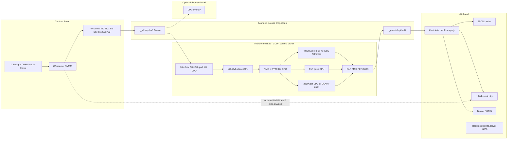
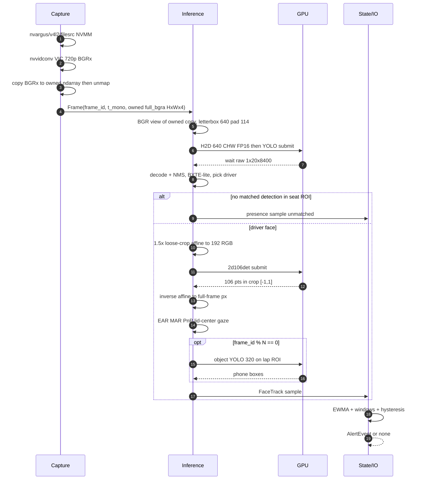
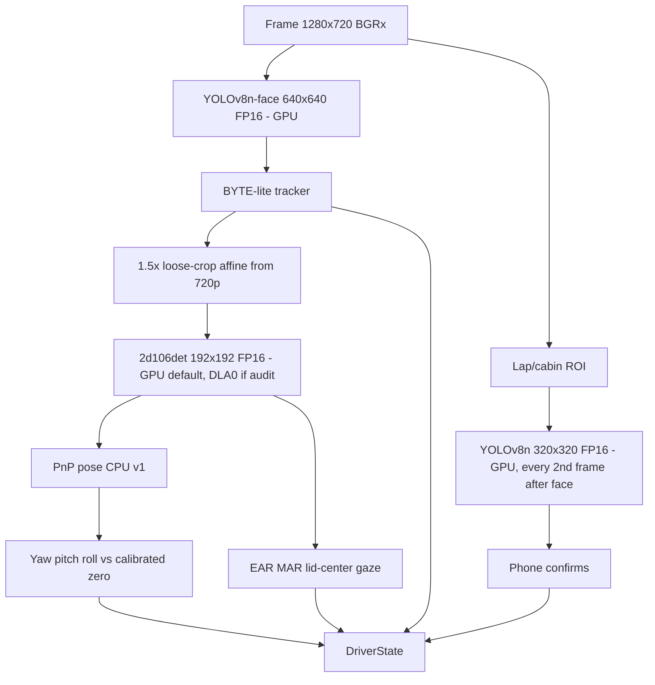
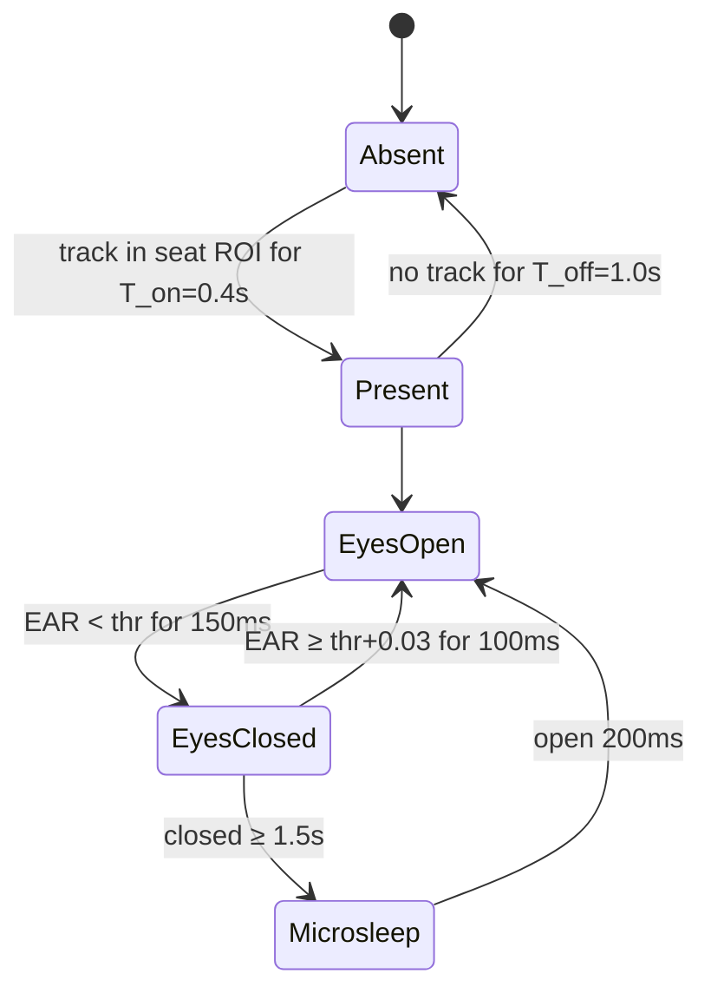
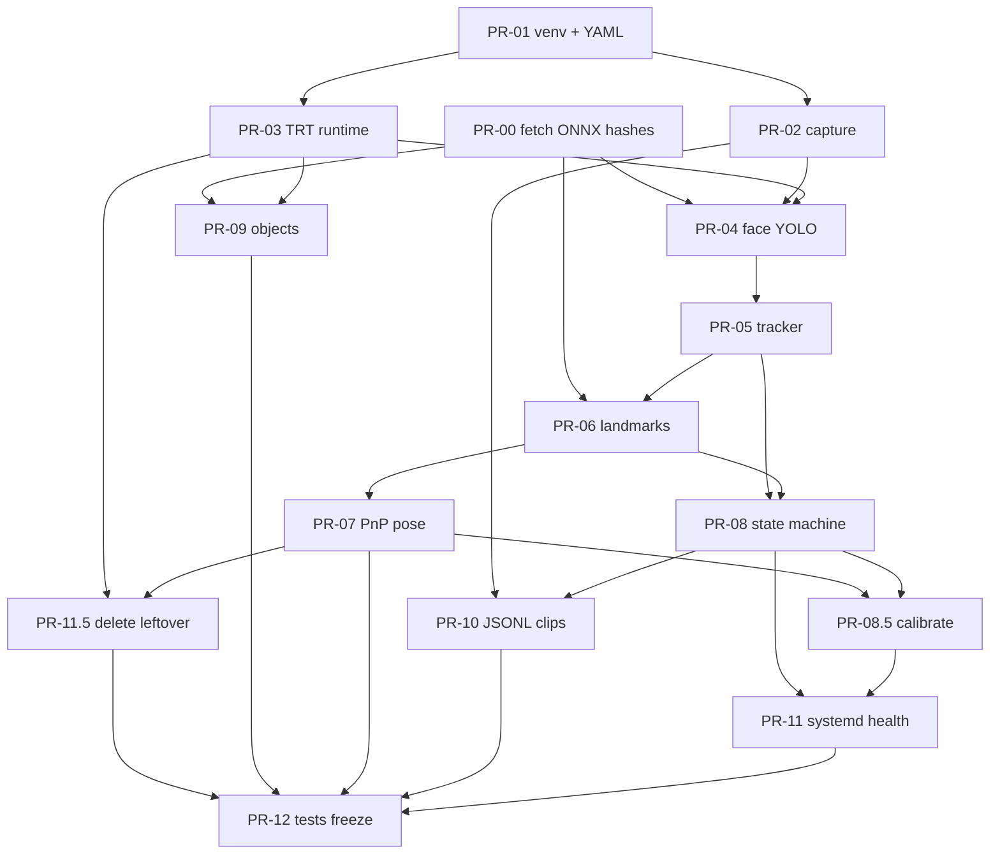

# Production Driver Monitoring System (DMS) for NVIDIA Jetson Xavier NX

| Field | Value |
| --- | --- |
| **Title** | Xavier NX In-Cabin Driver Monitoring System — Production Architecture |
| **Author** | TBD |
| **Date** | 2026-09-01 (rev 4) |
| **Status** | Draft |
| **Target hardware** | NVIDIA Jetson Xavier NX Developer Kit (`nvidia,p3449-0000+p3668-0001` / `tegra194`) |
| **Software baseline** | L4T R35.6.5 / JetPack 5.1.6-b5 / TensorRT 8.5.2.2 / CUDA 11.4.19 / Python 3.8.10 |
| **Repo** | `/home/nvidia/myspace/DMS` (remote: https://github.com/jakhon37/DMS.git) |
| **Scope of this document** | Design only. No implementation. |

---

## Overview

The current tree is a non-running template: `main.py` cannot import (`cv2`, `FACE_LABEL`, `OBJECT_LABELS` missing), every model class is `pass` or TensorFlow/`Haar`, `req.txt` is empty, and `readme.md` still targets a Jetson Nano with Haar cascades and Keras `.h5` files. Experimental folders show the intended direction (YOLOv8-face ONNX, InsightFace-style 112/192 landmarks, 6DRepNet head pose, TensorRT 8.5 `execute_async_v3`) but they depend on packages that are **not installed** on this board (`onnxruntime`, `pycuda`, `torch`, `tensorflow`, `deepface`) and on weight files that are **not in the tree**.

This document specifies a production in-cabin DMS that actually runs on **this** Xavier NX: GStreamer NVMM capture, a single TensorRT 8.5 runtime, a cascade of small FP16 engines with optional DLA offload, a per-driver temporal state machine (not per-frame flags), local event persistence, systemd, and a replay path that works with **no camera attached**. Peak RAM is budgeted to stay under **5.0 GB** of the measured **6.7 GiB MemTotal**, leaving ≥1.5 GB free. End-to-end **v1 contract** is **1280×720 at ≥15 FPS** (66.7 ms p95) in `MODE_20W_6CORE` with **sequential** inference (no overlap assumed). 30 FPS is **not** a v1 gate; it is a stretch only after the async TRT API is used **and** PR-04 measures overlap on this board.

---

## Background & Motivation

### Measured device (constraints, not marketing)

These numbers were taken on the development host and are binding:

| Item | Measured value |
| --- | --- |
| Machine | Jetson Xavier NX Developer Kit |
| Device tree | `nvidia,p3449-0000+p3668-0001` / `nvidia,tegra194` |
| TNSPEC | `3668-301-0001-G.0-1-2-jetson-xavier-nx-devkit-emmc-` |
| Kernel / L4T | Linux 5.10.216-tegra, R35.6.5, nvidia-jetpack 5.1.6-b5 |
| CPU | 6× ARMv8 Carmel, 1 thread/core, 115.2–1907.2 MHz, L2 6 MiB, L3 4 MiB |
| RAM | 6996988 kB MemTotal (~6.7 GiB); ~3.9 GiB available idle; 3.3 GiB swap |
| Disk | NVMe root `/dev/nvme0n1p1` 234 G, 33 G used, 200 G free; eMMC boot |
| Power mode | `MODE_20W_6CORE` (nvpmodel id 8) |
| Idle tegrastats | RAM 2644/6833 MB, SWAP 0/3416, CPU 23–41% @ 1420 MHz, GR3D 12%, CPU 37.5 C, GPU 35.5 C, thermal 36.15 C, PMIC 50 C |
| GPU clocks | 114.75–1109.25 MHz |
| TensorRT builder | FP16 yes, INT8 yes, TF32 no, **2 DLA cores**, max DLA batch 4096 |
| CUDA / cuDNN / TRT | 11.4.19 (`/usr/local/cuda-11.4`), cuDNN 8.6.0.166, TRT 8.5.2.2 (`import tensorrt` works; `trtexec` at `/usr/src/tensorrt/bin/trtexec`) |
| OpenCV | 4.5.4, GStreamer 1.16.2 **YES**, CUDA **NO** (`cv2.cuda.getCudaEnabledDeviceCount() == 0`) |
| NVIDIA GST plugins | `nvarguscamerasrc`, `nvv4l2camerasrc`, `nvv4l2decoder`, `nvv4l2h264enc/h265enc/vp9enc/av1enc`, `nvvidconv`, `nveglglessink`, `nv3dsink`, `nvdrmvideosink`, `nvjpegenc/dec`, `nvcompositor`, `nvivafilter` |
| DeepStream | **Not installed.** `nvinfer` / `nvinferserver` **absent** |
| Python | `/usr/bin/python3` 3.8.10; numpy **1.17.4** (too old); tensorrt 8.5.2.2; jetson-stats 7.2.1; Jetson.GPIO 2.1.9; onnx-graphsurgeon 0.3.12 **package present but unusable** (`import onnx_graphsurgeon` fails: no `onnx`) |
| PyGObject | `gi.repository.Gst` **1.16.3** installed (system). Capture binding is PyGObject, not `cv2.VideoCapture`. |
| Missing imports | tensorflow, torch, onnxruntime, pycuda, jetson_utils, deepface, onnx, cuda-python |
| Cameras | **None attached.** No `/dev/video*`. DT has `cam_i2cmux` i2c@0 and i2c@1 (dual CSI capable) |

Xavier NX production envelope:

- Usable RAM is **~6.8 GB**, not 8 GB. Budget the full pipeline so **peak ≤ 5.0 GB** with **≥ 1.5 GB free**.
- Current mode is 20 W 6-core. **v1 15 FPS gate applies only to `MODE_20W_6CORE` (id 8) with unlocked clocks.** 15 W 6-core is best-effort 15 FPS. 15 W 2-core (GPU often ~115 MHz) is a **degrade profile** (drop object net; optional 640→480 detector), not a 15 FPS promise.
- Try both NVDLAs for the two lighter models **after a build-log audit**; keep the detector on GPU. DLA is a hypothesis until `trtexec` verbose output shows layers actually on `[DLA]`.
- FP16 is v1 precision. INT8 is a later optimization PR (needs calibration set).
- Do not depend on DeepStream, PyTorch, or TensorFlow at runtime.
- OpenCV on this board is CPU-only. VIC (`nvvidconv`) does NV12→BGRx at capture size. The **one** allowed full-frame CPU resize is detector letterbox in `dms/runtime/preprocess.py` (720p→640×360, pad 114). No other `cv2.resize` / `warpAffine` on arrays with `h>=720`.
- Stay on JetPack 5.1.6 / L4T R35.6 / Python 3.8. No JetPack 6, no Python 3.10.

### Current repo state (why a rewrite, not a patch)

Git: 3 commits (`first commit`, `dms code update`, `project templete`). ~19 M, 171 files, **zero** `.onnx` / `.engine` / `.pt` in tree. `.gitignore` already excludes `models/*/weights`.

Broken “app”:

- [`main.py`](/home/nvidia/myspace/DMS/main.py): sequential loop; missing `import cv2` and label imports; `preprocess_image` / `draw_bounding_boxes` are `pass`; **object detection is inside the face loop** (N times per frame).
- [`config/config.py`](/home/nvidia/myspace/DMS/config/config.py): placeholder paths, `VIDEO_SOURCE = 0`.
- [`config/constants.py`](/home/nvidia/myspace/DMS/config/constants.py): `OBJECT_LABELS = ["Cigarette", "Phone", "Cap"]`.
- [`models/face_detection.py`](/home/nvidia/myspace/DMS/models/face_detection.py) / [`object_detection.py`](/home/nvidia/myspace/DMS/models/object_detection.py): `tf.saved_model.load` — TF is not installed.
- [`models/eye_detection.py`](/home/nvidia/myspace/DMS/models/eye_detection.py): Haar `CascadeClassifier` + `pass`.
- [`models/eye_gaze_detection.py`](/home/nvidia/myspace/DMS/models/eye_gaze_detection.py): `pass`.
- [`utils/video_stream.py`](/home/nvidia/myspace/DMS/utils/video_stream.py): blocking `cv2.VideoCapture(source)` — no GStreamer, no NVMM, no thread, no drop policy.
- [`readme.md`](/home/nvidia/myspace/DMS/readme.md): Jetson Nano + Haar + Keras tutorial.

Experimental intent worth salvaging (ideas, not code to ship):

- [`models/face_detect/models/yolov8.py`](/home/nvidia/myspace/DMS/models/face_detect/models/yolov8.py) + [`test.py`](/home/nvidia/myspace/DMS/models/face_detect/test.py): ONNXRuntime YOLOv8-face, `weights/yolov8n-face.onnx` **missing**; `cv2.resize` + print-debug in the hot path; conf/iou in `test.py` are `0.99972` / `0.99973` (unusable).
- [`models/face_detect/trt_infer.py`](/home/nvidia/myspace/DMS/models/face_detect/trt_infer.py) and [`models/face_allignment/trt_infer.py`](/home/nvidia/myspace/DMS/models/face_allignment/trt_infer.py): duplicated TRT 8.5 `Binding`/`Engine` using **pycuda** (not installed) and `execute_async_v3`.
- [`models/face_detect/onnx2trt.py`](/home/nvidia/myspace/DMS/models/face_detect/onnx2trt.py): workspace **`1 << 20` (1 MiB)** — will fail for real engines. Alignment [`onnx2trt.py`](/home/nvidia/myspace/DMS/models/face_allignment/onnx2trt.py) uses `1 << 30` (**1 GiB**, comment wrongly says “1 MiB”) or [`onnx2trt1.py`](/home/nvidia/myspace/DMS/models/face_allignment/onnx2trt1.py) `1 << 40` (1 TiB, nonsense on a 6.7 GiB board).
- [`models/face_detect/pt2onnx.py`](/home/nvidia/myspace/DMS/models/face_detect/pt2onnx.py): Ultralytics export at `imgsz=[480,640]` (non-square).
- [`models/face_allignment/onnx_infer.py`](/home/nvidia/myspace/DMS/models/face_allignment/onnx_infer.py): comments mention `2d106det.onnx`, `1k3d68.onnx`; hardcoded `weights/adnet/300w.onnx` at 256×256.
- [`models/headpose/drepnet/model6d.py`](/home/nvidia/myspace/DMS/models/headpose/drepnet/model6d.py): 6DRepNet with **RepVGG-B1g2** — too heavy to sit next to a 640 detector on this SoC (see model section).
- [`models/face_attributes/face_attr.py`](/home/nvidia/myspace/DMS/models/face_attributes/face_attr.py): DeepFace age/gender/emotion/**race** — out of scope and not installed.
- [`utils/convert.py`](/home/nvidia/myspace/DMS/utils/convert.py): PyTorch ONNX export with hardcoded `/home/fssv2/mushtariy/Head_pose/...`.

There is no tracker, no temporal fusion, no config schema, no tests, no logging, no systemd, no health endpoint, no clip recorder. Alerts, if they existed, would fire every frame.

---

## Goals & Non-Goals

### Goals (v1)

1. **Driver presence / face lost** with track hysteresis, not a single missed detection.
2. **Drowsiness**: eye aspect ratio (EAR), blink events, PERCLOS over a 60 s window, yawn via mouth aspect ratio (MAR).
3. **Distraction**: head-pose / gaze-away duration (phone-down, over-shoulder, lap).
4. **Secondary objects**: phone in a cabin/lap ROI; cigarette only when a 2-class engine exists (see objects decision). **Drop Cap.**
5. **Alert policy** with severity (`info` / `warn` / `critical`), hysteresis, cooldown.
6. **Night path**: design assumes a NIR/IR camera + 850 nm illuminator; RGB fallback with luminance-adaptive thresholds.
7. **Failure handling**: camera disconnect, engine load fail, thermal throttle, systemd watchdog restart.
8. **Replay from file** as a first-class source (mandatory: no camera is attached today).
9. **systemd** service, local-only privacy, structured JSONL events, optional H.264 event clips with disk quota.

### Non-goals (v1)

- Full occupant monitoring of all seats (OMS). Driver-seat ROI only.
- Emotion, race, age, gender, or any identity embedding (no ArcFace/ResNet100, no DeepFace).
- Cloud identity, fleet enrollment, or any off-box video upload.
- Training or ONNX export **on the Jetson**. Export happens on an x86/CUDA workstation; this board only builds TRT engines from ONNX (one-shot) and runs them.
- DeepStream as the default runtime.
- Haar cascades, TensorFlow/Keras runtime, PyTorch runtime, ONNX Runtime at runtime.
- JetPack 6 / Python 3.10 / OpenCV CUDA rebuild.
- UNECE R171 / Euro NCAP / GB/T **certification**. Schema should not paint us into a corner, but v1 is a research/engineering prototype unless the user says otherwise (open question).

---

## Key Decisions

| # | Decision | Rationale |
| --- | --- | --- |
| K1 | **Custom Python 3.8 + TensorRT 8.5 + GStreamer NVMM**, not DeepStream 6.3 | DeepStream is not installed; `nvinfer` is absent. DMS value is temporal state, not detect-and-overlay. Installing DS 6.3 is an optional later path, not v1. |
| K2 | **Runtime = TensorRT engines only.** No TF, Torch, ORT, DeepFace on device | Those packages are missing; they also explode RAM. Training/export is off-box. |
| K3 | **One TRT wrapper**: prefer **`cuda-python`**, **ctypes `libcudart.so` fallback**. Async `submit`/`wait_all` in PR-03; blocking `infer()` is a convenience wrapper | `pycuda` is not installed. `cuda-python` aarch64/cp38 wheels are **unproven on this board** — PR-03 must prove install before writing the wrapper. Do not build-from-source on the NX. |
| K4 | **Capture / appsink is 1280×720.** Detector letterbox 640×640 pad **114** in the inference thread. **v1 = ≥15 FPS p95 at 20 W 6-core sequential.** 30 FPS is stretch only after measured async overlap | 1080p **appsink** is not v1 (ISP/DRAM). Open question 7 is about the *camera module native mode*, not this size: a 1080p-only sensor is VIC-downscaled to 720p before appsink. Dual GST appsinks are forbidden (frame pairing). |
| K5 | **Face: YOLOv8n-face (derronqi) 640×640 FP16 on GPU.** Decode is `1×20×8400`, **not** `1×N×5`. **SCRFD-500m is v1.1** (different heads/decoder), not a one-line config switch | Repo already pointed at `yolov8n-face.onnx`. NMS/decode stay off DLA. Do not salvage `yolov8.py` `process_output`. |
| K6 | **Landmarks: InsightFace `2d106det` 192×192 FP16, 1.5× loose-crop affine.** **Device = GPU unless DLA0 audit passes** (PReLU typically GPU-fallbacks on TRT 8.5 DLA) | 5-point is too sparse for EAR **and yawn**. ADNet 256 / 1k3d68 heavier. 106-pt has eyelid contours + mouth, **not irises**. |
| K7 | **v1 head pose = PnP from 106 landmarks.** Do **not** ship RepVGG-B1g2. 6DRepNet-A0 is **v1.1** only with a named, hashed, licensed checkpoint — renaming `backbone_name` does **not** yield a trained A0 | Official 6DRepNet and this repo’s export scripts are B1g2. B1g2 weights are not loadable into A0. Untrained A0 is useless. |
| K8 | **Gaze v1 = PnP/head pose + eyelid-center** (mean of the 8 lid points per eye). Dedicated gaze net is v1.5+ | 2d106det has **no irises**. MediaPipe 478 does; we are not using it. |
| K9 | **Objects: YOLOv8n 320×320 FP16 on GPU, every Nth frame, on a configured lap/cabin ROI.** **Drop Cap.** Phone from COCO in v1; cigarette is v1.1 (custom 2-class) | Cap has no safety action. Never run object detect inside the face loop ([`main.py` L38–39](/home/nvidia/myspace/DMS/main.py)). |
| K10 | **Single process, 4 threads, bounded queues with drop-oldest.** Never block capture | CUDA context sharing across processes on Jetson is painful; state is cheap enough to keep in-process. |
| K11 | **IoU + BYTE-lite tracker**, driver = face whose box center is inside the calibrated driver-seat ROI | PERCLOS must be per-track, not per-detection. Full ByteTrack is overkill for one seat. |
| K12 | **YAML + pydantic v1 schema**, not a class of string literals | pydantic 1.10.x supports Python 3.8. |
| K13 | **FP16 v1, static shapes, batch=1.** `--memPoolSize=workspace:512M` is a **build-time** cap only. Runtime contexts allocate activations + a few pinned buffers (tens of MB), **not** 512 MB `cudaMalloc` per engine | The 1 MiB workspace in `onnx2trt.py` is a bug. Do not confuse builder pool with runtime RSS. |
| K14 | **venv `--system-site-packages`** for `cv2` (GStreamer) and `tensorrt`; pin numpy 1.23.5 in venv; never `pip install opencv-python` or `tensorflow` | System numpy 1.17.4 cannot host a modern stack; pip OpenCV would **drop** GStreamer and still have no CUDA. |
| K15 | **Headless default**; optional debug overlay behind `dms.display.enabled` | Production image should not require a desktop. Idle RAM is already 2.6 GB with GUI. |
| K16 | **Local-only privacy**: no race/emotion, no embeddings uploaded, clips off by default, 2 GB / 24 h quota when enabled | In-cabin video is biometric-adjacent. |

---

## Proposed Design

### Package layout (replace the template)

```
dms/                          # installable package (Python 3.8)
  __init__.py
  app.py                      # composition root, signal handling, systemd notify
  capture/
    gst_source.py             # single 720p appsink; copy-before-unmap; drop-oldest (PyGObject)
    pipelines.py              # CSI / USB / file pipeline strings (BGRx, not BGR)
  runtime/
    trt_engine.py             # THE TensorRT wrapper (cuda-python or ctypes cudart)
    preprocess.py             # letterbox pad=114, CHW, FP16 view
    dla.py                    # DLA device select + GPU fallback + build-log audit
  infer/
    face_detector.py          # YOLOv8n-face + NMS
    landmarks.py              # 2d106det
    head_pose.py              # v1 PnP; v1.1 optional 6DRepNet-A0
    objects.py                # ROI YOLO
  track/
    iou_tracker.py            # BYTE-lite
    driver_select.py          # seat ROI
  geometry/
    ear.py  mar.py  pnp.py    # pure functions, unit-tested
  state/
    driver_state.py           # EWMA, sliding windows
    alerts.py                 # hysteresis / cooldown / severity
  io/
    events.py                 # JSONL
    clips.py                  # H.264 ring via nvv4l2h264enc
    gpio_alert.py             # Jetson.GPIO buzzer
    health.py                 # HTTP 127.0.0.1 or unix socket
  calib/
    camera.py                 # extrinsics, forward-zero, seat ROI
  viz/
    overlay.py                # debug only
configs/
  default.yaml                # lab: source.type file, source.dev true
  production.yaml             # vehicle: source.type csi, source.dev false (installed to /etc/dms)
  schema.md                   # generated from pydantic
engines/                      # git-lfs or GitHub Release artifacts, not git blobs
  *.engine
  *.onnx                      # optional, for on-device rebuild
  MANIFEST.json               # sha256, TRT version, device, precision, DLA core
deploy/
  dms.service
  setup_jetson.sh             # documented nvpmodel / jetson_clocks, not silent
  logrotate.d/dms
scripts/
  build_engines.py            # ONNX → TRT, wraps trtexec, parses [DLA]/[GPU] layers
  fetch_onnx.sh               # pinned URLs + SHA256 (PR-00)
  calibrate_forward.py        # PR-08.5 / lands with PR-11
  replay.py
tools/
  export/README.md            # off-box ONNX export recipes (x86, not this NX)
tests/
  unit/                       # geometry + state machine
  test_no_mp.py               # R15: no multiprocessing under dms/
  replay/                     # fixtures (one indoor clip, one night clip)
```

Top-level `main.py`, `config/config.py`, and the TF/Haar stubs are deleted (see “What to delete vs reuse”).

### Process architecture

One process, four threads, one CUDA context created on the inference thread. Capture never shares the CUDA context.

**v1 capture is a single 720p appsink.** Do not run two independent `drop=true` appsinks: under load the 640 letterbox and the 720p crop would be different captures, and EAR/pose would run on the wrong pixels. Binding: **PyGObject** `gi.repository.Gst` 1.16.3 (system package `python3-gst-1.0`). `cv2.VideoCapture` is forbidden.



**Queue policy (non-negotiable):**

| Queue | Max depth | Full policy | Why |
| --- | --- | --- | --- |
| `q_full` | 1 | drop oldest (capture never blocks) | One `Frame` owns a **copied** 720p array (see buffer ownership); detector letterbox is derived in-inference so crops **cannot** desync |
| `q_event` | 64 | drop oldest + increment `events_dropped` | I/O stall must not stall inference |
| clip encoder queue | 4 | leaky=downstream in GST | Hardware encoder backpressure |

**Gst buffer ownership (v1 — do not skip):** appsink `max-buffers=1 drop=true` recycles the `GstBuffer` as soon as the capture thread unmaps it. A numpy view of `GstMapInfo.data` is then a use-after-unmap (inference letterbox / 1.5× affine / overlay hold the array across a CUDA round-trip). PR-02 **copies** (or `np.array(..., copy=True)`) on the capture thread **before** `gst_buffer_unmap`, then queues the owned `(720, 1280, 4)` uint8 array. Cost ≈ 3.6 MB, inside the 1.5–3 ms capture budget. Read `GstVideoMeta` stride; if `stride != width*4`, copy-to-packed (do not assume 1280×4 is packed on file/USB). Zero-copy GST refcounting (`gst_buffer_ref` + map for the Frame lifetime) is **v1.1**, not v1.

Capture thread timestamps each frame with `time.monotonic_ns()` and a monotonic `frame_id` **before** the owned copy is queued. Inference logs `capture_lag_ms = now - stamp`. If `capture_lag_ms > 200` for 30 consecutive frames, emit `PIPELINE_STARVED` and skip object net until lag recovers.

**v1.1 optional:** a VIC tee that downscales to 640×360 in NVMM **plus** a pad probe that copies `GstBuffer.pts` onto both branches, with the capture thread pairing by PTS and dropping the pair if either side is missing. Not v1 — pairing bugs are worse than ~1–2 ms of CPU letterbox on 720p.

### Per-frame sequence (v1 sequential; overlap is stretch)

v1 runs **sequentially** on the inference thread: face YOLO → NMS/track → 1.5× affine 192 → 2d106det → PnP → optional object YOLO. The 15 FPS gate (66.7 ms) is this sequential path. Concurrent DLA∥GPU is **stretch only**, and requires `TrtEngine.submit` / `wait_all` (Issue-3 API) **and** a DLA audit that left those engines on DLA. Object YOLO shares the GPU with face YOLO and **cannot** overlap it.



### GStreamer pipelines (exact strings)

`nvvidconv` on this board **cannot produce `format=BGR`**. `gst-inspect-1.0 nvvidconv` src/sink caps are `{I420, UYVY, YUY2, YVYU, NV12, NV16, NV24, GRAY8, BGRx, RGBA, Y42B, Y444, …}`. Requesting BGR fails to negotiate. v1 uses **BGRx** out of VIC and a numpy view `arr[..., :3]` as BGR (BGRx layout is B,G,R,X). Do **not** insert `videoconvert` on the hot path.

All pipelines: one appsink `max-buffers=1 drop=true sync=false`. Config selects `source.type: csi | usb | file`. Binding: PyGObject (`gi.repository.Gst`).

**CSI (Argus) — production default when a CSI module is attached**

```text
nvarguscamerasrc sensor-id={sensor_id} wbmode=0 saturation=1.0 !
  video/x-raw(memory:NVMM), width=1280, height=720, format=NV12, framerate=30/1 !
  nvvidconv ! video/x-raw(memory:NVMM), format=NV12 ! tee name=t
    t. ! queue max-size-buffers=2 leaky=downstream !
      nvvidconv interpolation-method=1 !
      video/x-raw, width=1280, height=720, format=BGRx !
      appsink name=full emit-signals=false max-buffers=1 drop=true sync=false
```

If and only if `clips.enabled=true`, add a second tee branch (NVMM stays encoded; it is **not** a second appsink):

```text
    t. ! queue max-size-buffers=4 leaky=downstream !
      nvv4l2h264enc iframeinterval=30 bitrate=2000000 insert-sps-pps=1 !
      h264parse ! mux.video_0
      splitmuxsink name=mux location={clip_dir}/ring_%05d.mp4 max-size-time=10000000000
```

Notes:

- VIC does NV12→BGRx at capture size. Detector letterbox (scale 0.5 → 640×360, pad 140+140 with **value 114**, Ultralytics convention) is in `dms/runtime/preprocess.py` on the inference thread so the 640 tensor and the 720p crop are the **same** `frame_id`.
- Black (`fill=0`) letterbox is forbidden: it hurts YOLO and would bias `Y_mean`.
- `wbmode=0` is a starting point for NIR (AWB fights IR). Final sensor-mode/gain is camera-specific (open question).

**USB UVC (MJPEG) — lab fallback**

```text
v4l2src device={device} io-mode=2 !
  image/jpeg, width=1280, height=720, framerate=30/1 !
  nvv4l2decoder mjpeg=1 ! video/x-raw(memory:NVMM) !
  nvvidconv ! video/x-raw(memory:NVMM), format=NV12 ! tee name=t
    t. ! queue max-size-buffers=2 leaky=downstream !
      nvvidconv ! video/x-raw, width=1280, height=720, format=BGRx !
      appsink name=full emit-signals=false max-buffers=1 drop=true sync=false
```

Raw YUYV USB (no MJPEG) is a last resort: `v4l2src ! video/x-raw,format=YUY2 ! nvvidconv ! video/x-raw,format=BGRx ! appsink`. Prefer MJPEG or CSI.

**File replay (mandatory for v1 development and CI)**

```text
filesrc location={path} !
  qtdemux ! h264parse ! nvv4l2decoder !
  nvvidconv ! video/x-raw, width=1280, height=720, format=BGRx !
  appsink name=full emit-signals=false max-buffers=1 drop=true sync=false
```

Also accept `videotestsrc ! video/x-raw,width=1280,height=720,format=BGRx ! appsink` for bring-up (`source.type: test`).

**PR-02 smoke (must pass on this board before merging capture):**

```bash
gst-launch-1.0 -e videotestsrc num-buffers=30 !
  video/x-raw,width=1280,height=720,format=NV12 !
  nvvidconv ! video/x-raw,width=1280,height=720,format=BGRx !
  fakesink
# Must NOT be: format=BGR  (will not negotiate)
```

**Camera-lost handling:** GST bus thread watches `ERROR` / `EOS`. On error: push a sentinel `Frame(ok=False)`, retry pipeline start with exponential backoff (0.5 s, 1 s, 2 s, 5 s, 5 s). After 5 failures, `Health.camera = failed`. Default `camera.fail_fatal: false`. systemd still gets `READY=1` (see Service) so a missing camera does not hit `TimeoutStartSec`. Replay (`source.type: file`) with a missing file **is** fatal (exit 2) — that is a config error, not a camera blip.

**File-source footgun (R13):** do **not** refuse `READY=1` for `source.type: file` — that is the lab/replay path and the anti-restart-loop default. Do make it loud:

- Once at startup (not per frame), log **WARNING** `SOURCE_FILE` if `source.type` is `file` or `test` **and** `source.dev` is not `true`.
- Always set `Health.source` to the enum value and `Health.dev_replay` true for file/test.
- `configs/default.yaml` (repo/lab) has `source.dev: true`. `setup_jetson.sh` installs `/etc/dms/default.yaml` from `configs/production.yaml` with `source.dev: false` and `source.type: csi` (operator must confirm). Under systemd (`NOTIFY_SOCKET` set) a file/test source with `dev: false` is the vehicle-misconfig case — still READY, still warning + health flag, never a restart loop.
- A path under `tests/` is **not** sufficient to suppress the warning (the lab default path is `tests/replay/...`; that would hide a shipped-to-vehicle default.yaml).

### TensorRT runtime (one module)

Replace every copy of `Binding`/`Engine` in `models/face_detect/trt_infer.py`, `trt_infer1.py`, `models/face_allignment/trt_infer.py`, `trt_infer__.py`.

**Choice: `cuda-python` if a cp38-aarch64 wheel installs on this NX; else ctypes `CDLL("libcudart.so")`.** System `tensorrt` 8.5.2.2 either way.

Why not pycuda: not installed; extra Boost/setup.py pain on aarch64. Why not ORT TRT EP: `onnxruntime` not installed. Why not “cuda-python only”: PyPI wheels for 11.4/cp38/aarch64 are historically sparse; PR-03 **proves install first** and keeps a ctypes cudart path (`cudaMalloc`, `cudaMemcpyAsync`, `cudaStreamCreate`, `cudaEventRecord`, `cudaEventQuery`). Do not compile cuda-python from source on the NX. Do not use `cudaEventSynchronize` for `wait()` — it has no timeout.

```python
# dms/runtime/trt_engine.py (interface — implement in PR-03)
from dataclasses import dataclass
from typing import Dict, List, Optional, Tuple
import numpy as np

@dataclass
class Binding:
    name: str
    is_input: bool
    dtype: np.dtype
    shape: Tuple[int, ...]
    nbytes: int
    host: np.ndarray          # pinned, sized to the tensor (NOT a 512 MiB workspace)
    device: int               # CUdeviceptr as int

@dataclass
class WorkItem:
    engine_id: str
    stream: int               # cudaStream_t
    event: int                # cudaEvent_t recorded after execute_async_v3
    outputs: Dict[str, np.ndarray]  # host buffers; valid after wait()

class TrtEngine:
    def __init__(self, engine_path: str, *, dla_core: Optional[int] = None):
        """Deserialize a prebuilt .engine. dla_core is informational
        (baked in at build). Do not cudaMalloc a 512 MiB workspace here;
        TRT 8.5 context allocates activations internally."""

    def submit(self, inputs: Dict[str, np.ndarray]) -> WorkItem:
        """H2D on this engine's stream, set_tensor_address, execute_async_v3,
        record event. Returns without waiting. D2H is queued on the same
        stream after execute (or in wait() — pick one and keep it)."""

    def wait(self, item: WorkItem, timeout_ms: float = 500.0) -> Dict[str, np.ndarray]:
        """Poll cudaEventQuery in a loop until cudaSuccess or wall-clock
        timeout_ms. Do NOT cudaEventSynchronize (it blocks forever; there is
        no timeout argument). On timeout raise DlaHangError (caller skips
        this model this frame)."""

    @staticmethod
    def wait_all(items: List[WorkItem], timeout_ms: float = 500.0) -> List[Dict[str, np.ndarray]]:
        """Wait every item. Used by the stretch overlap path."""

    def infer(self, inputs: Dict[str, np.ndarray]) -> Dict[str, np.ndarray]:
        """Convenience: submit + wait. v1 sequential path uses this."""

    def infer_d2d(self, input_dev_ptrs: Dict[str, int]) -> WorkItem:
        """Skip H2D when preprocess already landed in device memory (v1.5)."""

    @property
    def input_shape(self) -> Tuple[int, ...]: ...
```

v1 pipeline calls `infer()` (blocking) in order. Stretch 30 FPS may call `submit` on landmarks and (if a pose net exists) pose **only after** face YOLO `wait()` returns, and **only if** those engines’ MANIFEST `dla_gpu_fallback_layers` is below the 20% gate. Never `submit` object YOLO until face YOLO has finished: they share the GPU.

Implementation notes for TRT 8.5 (this board, not TRT 10):

- Use `engine.num_io_tensors`, `get_tensor_name`, `get_tensor_mode`, `get_tensor_dtype`, `get_tensor_shape` — **not** the removed `max_batch_size` / `binding_is_input` path in [`trt_infer__.py`](/home/nvidia/myspace/DMS/models/face_allignment/trt_infer__.py).
- `context.execute_async_v3(stream.handle)` as in the salvageable [`trt_infer.py`](/home/nvidia/myspace/DMS/models/face_detect/trt_infer.py). **Salvage of that file happens inside PR-03**, then the prototype files are deleted in the same PR.
- Pinned host = tensor nbytes only. Device buffers = tensor nbytes only.
- One `cudaStream_t` per engine.
- **No dynamic shapes.** All engines `1×3×H×W`.
- Load-fail is fatal at process start unless a GPU-fallback engine path is configured (`engines.landmarks.gpu_fallback`).

### Model cascade and DLA map



| Model | Input | Precision | Device (v1) | Why | Postprocess |
| --- | --- | --- | --- | --- | --- |
| YOLOv8n-face (derronqi) | 1×3×640×640 | FP16 | **GPU** | Decode/NMS/kpt head are DLA-hostile | See Engine contract. Salvage `nms` from [`utils.py`](/home/nvidia/myspace/DMS/models/face_detect/models/utils.py); **do not** salvage `yolov8.py` `process_output` (it treats `[:, 4:]` as class scores — wrong for a kpt head). |
| 2d106det | 1×3×192×192 | FP16 | **GPU default.** DLA0 only if build-log `[DLA]` fraction ≥ 80% | MobileNet-0.5 uses **PReLU**; TRT 8.5 DLA activations are ReLU/Sigmoid/TanH/Clipped ReLU/Leaky ReLU — PReLU typically GPU-fallbacks. A “DLA” engine that is mostly GPU is worse than a GPU engine (extra copies + contention with YOLO). | Inverse affine; EAR in full-frame px |
| PnP | 6×2D + 6×3D mm | — | **CPU (v1 pose)** | No extra engine; official 6DRepNet is B1g2 | `cv2.solvePnP` ITERATIVE |
| 6DRepNet-A0 | 1×3×224×224 | FP16 | **v1.1**, DLA1 try-and-audit | Not a rename of B1g2. Needs a named hashed checkpoint. Off-box rewrite `AdaptiveAvgPool2d`→`AvgPool2d(7)` and `Linear`→`Conv2d 1×1` before DLA build | Euler on CPU from 6D; never `atan2` in-graph |
| YOLOv8n-obj | 1×3×320×320 | FP16 | **GPU**, after face YOLO | Same YOLO-head reason; **cannot** overlap face YOLO | CPU NMS, class filter `cell phone=67` |

**DLA limitations to respect at engine-build time (TRT 8.5 / Xavier):**

- No dynamic shapes, no `INonZero`, limited `ISlice`/`IShuffle` (batch/reshape Shuffle is a known DLA fallback), no YOLO NMS plugin on DLA, **no PReLU**.
- `scripts/build_engines.py` runs `trtexec --verbose` and parses layers tagged `[DLA]` vs `[GPU]`. Writes `dla_gpu_fallback_layers` + `dla_layer_fraction` into `MANIFEST.json`. **Gate:** if GPU-fallback layers > 20% of layers, **discard the DLA engine** and ship the GPU engine. `--allowGPUFallback` without this gate silently lands fallbacks on the same GPU as face/object YOLO and destroys any overlap story.
- Do not `submit` object YOLO until DLA work is actually queued on DLA streams (stretch path only).
- DLA numerical parity: 50 replay frames vs GPU engine, max mean landmark error 1.5 px @192 (`tests/replay/dla_parity.py`).

**ROI reuse rule:** the face detector runs **once per frame**. Landmarks and PnP run **once per selected driver track** (batch=1). Object detect runs on a **fixed cabin ROI**, never inside `for face in faces`.

### Model choices vs repo experiments

**Face — YOLOv8n-face (derronqi), keep the repo’s direction, fix decode.**

- [`test.py`](/home/nvidia/myspace/DMS/models/face_detect/test.py) expected `weights/yolov8n-face.onnx`.
- **Not** `1×N×5`. derronqi/yolov8-face is 1 class + 5 kpts. Common ONNX layout at 640: **`output0` = `1×20×8400`** (4 box + 1 obj + 15 kpt). [`yolov8.py`](/home/nvidia/myspace/DMS/models/face_detect/models/yolov8.py) `process_output` treating `predictions[:, 4:]` as class scores is **wrong** for this head — do not port it.
- Input **640×640**, not `[480,640]` in [`pt2onnx.py`](/home/nvidia/myspace/DMS/models/face_detect/pt2onnx.py).
- Conf **0.45**, IoU **0.45** (the 0.999xx values in `test.py` detect nothing).
- 5 kpts are a bonus for a sanity check against 106; they do **not** replace 106-pt (no mouth, weak EAR).
- **SCRFD-500m is v1.1**, not a config enum in v1. It has 3-stride score/bbox/kps heads and a different decoder. If YOLO-face p95 > 18 ms in PR-04, file an issue and schedule a SCRFD PR — do not “flip a name.” YuNet (OpenCV Zoo) is a CPU-only lab toy, not a production detector here.

**Landmarks — InsightFace 2d106det with the official 1.5× loose crop, not a raw-box resize.**

Repo comments name `2d106det.onnx`; the live script uses `weights/adnet/300w.onnx` and is **not** a reference implementation.

InsightFace `Landmark.get()` contract (freeze this):

1. Let `x1,y1,x2,y2` be the **tracked** face box in full-frame px (720p).
2. `w, h = x2-x1, y2-y1`; `cx, cy = (x1+x2)/2, (y1+y2)/2`.
3. `side = 1.5 * max(w, h)`. Square centered on `(cx, cy)`.
4. Build a 2×3 affine that maps that square onto `192×192` (no extra rotation in v1; yaw is handled by the net / PnP). `cv2.warpAffine` on the **ROI-sized** warp, border value 0.
5. Input blob: RGB, NCHW float32, **mean 0 / std 1** (uint8 cast to float; **not** `/255`).
6. Output `1×212` (or `1×106×2`) in **[-1, 1]** relative to the 192 crop: `u = (x_norm + 1) * 0.5 * 192`.
7. Apply the **inverse affine** so `landmarks106` is full-frame px. EAR/MAR/PnP run only in that frame.

Tight/stretched `cv2.resize` of the raw YOLO box systematically biases EAR and the PnP subset. Unit-test: fixture image + stored 106-pt after inverse affine, max mean error 2 px.

ADNet 256 and `1k3d68.onnx` stay deleted.

**Head pose — v1 is PnP. A0 is not a drop-in of this repo.**

[`model6d.py`](/home/nvidia/myspace/DMS/models/headpose/drepnet/model6d.py) and [`utils/convert.py`](/home/nvidia/myspace/DMS/utils/convert.py) hardcode `backbone_name='RepVGG-B1g2'`. `func_dict` in [`repvgg.py`](/home/nvidia/myspace/DMS/models/headpose/drepnet/backbone/repvgg.py) **does** contain `RepVGG-A0` (ungrouped, DLA-friendlier), but **B1g2 weights are not loadable into A0**. `SixDRepNet(backbone_name='RepVGG-A0', pretrained=False)` is an untrained head. Do not export that.

v1: `cv2.solvePnP` on the frozen 6-point subset below + canonical 3D mean face (mm). Always available, no extra RAM.

v1.1 (only if a checkpoint is fetched with SHA256 + license in `scripts/fetch_onnx.sh`): 6DRepNet-RepVGG-A0 (~9.1 M / ~1.5 GFLOP @224). Candidate sources to evaluate off-box, **not** blessed until hashed: HuggingFace `X01D/6DRepNET-RepVGGA0`; Shohruh72/SixDRepNet. Export: `deploy=True`, static `1×3×224×224`, **no** dynamic axes, **no** in-graph `atan2` Euler (the wrappers in [`convert2onnx.py`](/home/nvidia/myspace/DMS/models/headpose/convert2onnx.py) are DLA-hostile). Rewrite GAP+FC to `AvgPool2d(7)` + `Conv2d 1×1` before DLA. If `|euler_net - euler_pnp| > 15°`, prefer PnP and increment `pose_disagreement`.

**Do not ship RepVGG-B1g2** next to YOLO-640 on this SoC.

**Gaze — no dedicated net in v1; no irises.**  
2d106det has eyelid contours (and optional pupil-ish points 96/97 — treat as extra eye-center estimates, **not** irises). Gaze v1 = PnP yaw/pitch + **lid-center** (mean of the 8 lid points) relative to the eye-corner axis. “Looking down at lap” = calibrated pitch > threshold **or** lid-center below the inner-corner line. MediaPipe 478 has irises but is not a TRT engine and is out of v1. Dedicated gaze (L2CS) is v1.5.

**Objects — drop Cap; phone v1; cigarette v1.1.**

| Class | v1 | Why |
| --- | --- | --- |
| Phone | Yes, COCO `cell phone` on YOLOv8n 320, cabin ROI | Direct distraction signal; COCO weights exist; no on-device training |
| Cigarette | Interface + label reserved; engine optional | Not in COCO; needs a custom 2-class set. Shipping a fake class would page false criticals |
| Cap | **Dropped** | No safety action; hats are normal; Euro NCAP / R171 do not treat “cap” as a primary DMS metric |

Never a general COCO-m. Never inside the face loop.

**DeepFace — deleted.** [`face_attr.py`](/home/nvidia/myspace/DMS/models/face_attributes/face_attr.py) analyzes race/emotion. Out of scope, missing dep, privacy-hostile.

### Engine / I/O contracts (frozen)

Hashes in the table are **placeholders** until `scripts/fetch_onnx.sh` (PR-00) downloads and writes the real SHA256 into `engines/MANIFEST.json`. PRs 04/06/07/09 must not merge without a filled hash. Licenses must be recorded; Ultralytics YOLOv8 is AGPL-3.0 — if that is unacceptable for the product, swap the object net before v1 freeze (open question 10).

| Engine | Artifact | License (verify at fetch) | Input | Color / norm | Output | Decode |
| --- | --- | --- | --- | --- | --- | --- |
| Face | derronqi `yolov8n-face` ONNX, imgsz=640 square. Export off-box: `yolo export model=yolov8n-face.pt format=onnx opset=12 imgsz=640 simplify=True`. Upstream: https://github.com/derronqi/yolov8-face | Check repo (often AGPL via Ultralytics) | `images` `1×3×640×640` FP32/FP16 NCHW | **RGB** `/255` | `output0` **`1×20×8400`** | See pseudocode below |
| Landmarks | InsightFace `2d106det.onnx` from `buffalo_l` (https://github.com/deepinsight/insightface/releases/download/v0.7/buffalo_l.zip, file `2d106det.onnx`) | InsightFace model terms (record at fetch; often research-use) | `data` `1×3×192×192` | **RGB**, mean 0, std 1 (float32 0–255, **not** `/255`) | `fc1` `1×212` | reshape 106×2, `[-1,1]` → crop px → inverse affine |
| Pose v1 | none | — | 6×2D full-frame + 6×3D mm | — | yaw/pitch/roll deg | `cv2.solvePnP` |
| Pose v1.1 | 6DRepNet-A0 ONNX, static 224, 6D output. **Not** this repo’s B1g2 snapshot | TBD with checkpoint | `input` `1×3×224×224` | RGB, ImageNet mean/std | `1×6` ortho6d | CPU 6D→R→euler; no in-graph atan2 |
| Objects | Ultralytics YOLOv8n COCO 320. `yolo export model=yolov8n.pt format=onnx opset=12 imgsz=320` | AGPL-3.0 | `images` `1×3×320×320` | RGB `/255` | `1×84×2100` typical | xywh + 80 cls; keep class **67 cell phone** |

**YOLOv8-face decode (derronqi, 640, 1 class, 5 kpts):**

```
pred = output0.reshape(20, 8400).T          # 8400 x 20
xywh, obj, kpts = pred[:, 0:4], pred[:, 4], pred[:, 5:20]
keep = obj > conf                           # 0.45
# letterbox inverse (capture 1280x720, scale=0.5, pad_x=0, pad_y=140):
#   x_full = (x_640 - 0) / 0.5
#   y_full = (y_640 - 140) / 0.5
xyxy = xywh_to_xyxy(xywh[keep]); xyxy = letterbox_inv(xyxy, scale=0.5, pad=(0, 140))
kpts_xy = kpts[keep].reshape(-1, 5, 3)[..., :2]
kpts_xy = letterbox_inv_pts(kpts_xy, scale=0.5, pad=(0, 140))
idx = nms(xyxy, obj[keep], iou=0.45)        # single-class NMS
```

Letterbox forward (inference preprocess): `scale = min(640/1280, 640/720) = 0.5` → resized `640×360`; pad top=140, bottom=140, **value 114**; result `640×640`. Same `scale`/`pad` used to invert boxes.

**Working 106-pt index table** (JD-106-shaped, counts to 106). This is the **starting** map for EAR/MAR/PnP so the rest of the design can be implemented. Public 2d106det maps disagree (e.g. UniFace: nose 51–62, eyes 63–86, mouth 87–105). If index 60 is not the left outer canthus on `buffalo_l` `2d106det.onnx`, MICROSLEEP/YAWN are silently wrong.

**Verification (required, not optional):**

- PR-00 dumps actual ONNX input/output names (`onnx` or `trtexec --dumpLayerInfo`); do not assume `data` / `fc1`.
- PR-06 overlays predicted points on a fixture vs the InsightFace `coordinate_reg` 106-point diagram and **rewrites** `dms/geometry/face106.py` if the semantic labels do not match. The inverse-affine “2 px mean error” test is **not** this check.
- **All** EAR/MAR/PnP/lid-center code imports named constants from `face106.py`. Do not scatter `60`/`64`/`76` literals in `ear.py` / `mar.py` / `pnp.py`.

`dms/geometry/face106.py` is the **only** place this table may be corrected. Do not mix with iBUG-68 or MediaPipe 468.

```
contour     0..32
brow_L      33..41     # subject left
brow_R      42..50
nose        51..59     # 54 = nose tip
eye_L       60..67     # 8-pt lid, 60=outer, 64=inner
eye_R       68..75     # 68=outer, 72=inner
mouth_outer 76..87     # 12-pt, 76=left corner, 82=right, 79=upper mid, 85=lower mid
mouth_inner 88..95
eye_center_L 96        # extra; NOT an iris
eye_center_R 97
extra       98..105
```

EAR 6-point (Soukupová & Čech order p1..p6 = outer, upper-outer, upper-inner, inner, lower-inner, lower-outer):

```
LEFT_EYE_EAR  = (60, 61, 63, 64, 65, 67)
RIGHT_EYE_EAR = (68, 69, 71, 72, 73, 75)
EAR = (|p2-p6| + |p3-p5|) / (2 |p1-p4|)
EAR_face = 0.5 * (EAR_L + EAR_R)
```

MAR:

```
MOUTH_LEFT, MOUTH_RIGHT, MOUTH_UP, MOUTH_LOW = 76, 82, 79, 85
MAR = |UP-LOW| / |LEFT-RIGHT|
```

Lid-center (gaze v1): `mean(eye_L[60:68])`, `mean(eye_R[68:76])`. Prefer 96/97 when they are finite and within the lid bbox; still not irises.

PnP 6-point subset + canonical 3D mean face (mm), OpenCV camera frame, origin at nose tip, +X right, +Y down, +Z toward camera:

```
# index : 3D mm
60 left outer  : (-34.0, -30.0, -30.0)
64 left inner  : (-12.0, -30.0, -30.0)
72 right inner : ( 12.0, -30.0, -30.0)
68 right outer : ( 34.0, -30.0, -30.0)
54 nose tip    : (  0.0,   0.0,   0.0)
mouth center   : (  0.0,  32.0, -28.0)   # 2D = 0.5*(pt[76]+pt[82])
```

`cv2.solvePnP(..., flags=cv2.SOLVEPNP_ITERATIVE)` then `Rodrigues` → yaw/pitch/roll with the same convention as `draw_axis` in [`drepnet/utils.py`](/home/nvidia/myspace/DMS/models/headpose/drepnet/utils.py) (debug only). Unit-test sign: a face looking camera-left must produce yaw of the documented sign after `forward_zero`.

If PR-06’s labeled overlay shows a different order, **change this table in `face106.py` only** and the tests that import it.

### Engine build pipeline

Off-box: PyTorch/Ultralytics/InsightFace → ONNX opset 12–13 (TRT 8.5 parser is happiest here; opset 14 in [`utils/convert.py`](/home/nvidia/myspace/DMS/utils/convert.py) is acceptable if it parses). Simplify with `onnxsim` off-box.

On-device (one-shot, not every boot):

`--explicitBatch` is **not** in this board’s `trtexec --help`; TRT 8.5’s ONNX parser is already explicit-batch. Do not pass it.

`--memPoolSize=workspace:512M` (GPU) / `64M` (DLA) is a **builder** cap so the 1 MiB cargo-cult cannot recur. It is **not** allocated at runtime.

```bash
# GPU detector — builder workspace 512 MiB, not 1 MiB
/usr/src/tensorrt/bin/trtexec \
  --onnx=models/yolov8n-face.onnx \
  --saveEngine=engines/yolov8n-face_640_fp16_gpu.engine \
  --fp16 \
  --shapes=images:1x3x640x640 \
  --memPoolSize=workspace:512M \
  --timingCacheFile=engines/timing.cache \
  --verbose 2> engines/yolov8n-face.build.log

# Landmarks: always build GPU. Optionally try DLA0 and keep it only if audit passes.
/usr/src/tensorrt/bin/trtexec \
  --onnx=models/2d106det.onnx \
  --saveEngine=engines/2d106det_192_fp16_gpu.engine \
  --fp16 --shapes=data:1x3x192x192 \
  --memPoolSize=workspace:64M --verbose 2> engines/2d106det.gpu.build.log

/usr/src/tensorrt/bin/trtexec \
  --onnx=models/2d106det.onnx \
  --saveEngine=engines/2d106det_192_fp16_dla0.engine \
  --fp16 --useDLACore=0 --allowGPUFallback \
  --shapes=data:1x3x192x192 \
  --memPoolSize=workspace:64M --verbose 2> engines/2d106det.dla0.build.log
```

`scripts/build_engines.py` wraps this, greps the verbose log for `[DLA]` / `[GPU]` layer counts, and writes `engines/MANIFEST.json`:

```json
{
  "l4t": "35.6.5",
  "tensorrt": "8.5.2.2",
  "cuda": "11.4.19",
  "device": "xavier-nx",
  "precision": "fp16",
  "engines": {
    "face": {
      "path": "yolov8n-face_640_fp16_gpu.engine",
      "onnx_sha256": "...",
      "engine_sha256": "...",
      "dla": null,
      "dla_gpu_fallback_layers": 0,
      "dla_layer_fraction": 0.0
    },
    "landmarks": {
      "path": "2d106det_192_fp16_gpu.engine",
      "dla": null,
      "dla_tried": true,
      "dla_rejected_reason": "prelu_fallback_gt_20pct"
    }
  }
}
```

Boot path: if `MANIFEST.json` TRT version ≠ running TRT, **refuse to start** with a clear log (`ENGINE_VERSION_MISMATCH`) rather than deserialize-crash. Rebuild is an operator step, not a silent 20-minute boot.

Check engines into **Git LFS** or a GitHub Release. Do not commit 50 MB binaries to git the way `__pycache__` currently is.

### Tracking (PERCLOS is per-driver)

`BYTE-lite` (high-score IoU association, then low-score leftover, Kalman optional in v1.1):

- Input: detections `xyxy`, `score ≥ 0.45`.
- Match if IoU ≥ 0.3.
- Unmatched tracks persist `max_lost=20` frames (~1.3 s at 15 FPS) so a blink/occlusion does not mint a new id. `lost_frames` increments when unmatched; a match resets it to 0.
- Unmatched detections spawn a new track.
- **`live` for ID reuse:** a track with `lost_frames < max_lost` may still be matched (this is what prevents ID churn).
- **`present` / driver selection:** only tracks with **`lost_frames == 0`** (matched this frame) whose box center lies in `calib.driver_roi` (normalized `[x0,y0,x1,y1]`, default LHD `[0.0, 0.0, 0.65, 1.0]`) count as a visible driver.
- **FACE_LOST** uses wall time since the last **matched** detection in the seat ROI (`t_last_match`), **independent of whether a coasting track id still exists**. Enter when `now - t_last_match ≥ 1.0 s`. Exit when a matched-in-ROI detection lasts ≥ 0.4 s. Coasting tracks (`0 < lost_frames < max_lost`) keep the id for PERCLOS continuity **if** the next match is the same person; they do **not** suppress FACE_LOST.
- PERCLOS, blink, yawn, pose EWMA live on `FaceTrack.samples`, keyed by `track_id`. When id switches, **reset windows** (do not stitch two people).

Do not run a ReID embedding (ResNet100 in `onnx_infer.py` is identity — out of scope).

### Geometry (pure functions, tested)

**EAR** (eye aspect ratio), 6 points per eye from the frozen table in Engine contracts (`LEFT_EYE_EAR` / `RIGHT_EYE_EAR`). Landmarks must already be in **full-frame px** (inverse affine applied).

```
EAR = (|p2-p6| + |p3-p5|) / (2 |p1-p4|)
EAR_face = 0.5 * (EAR_L + EAR_R)
```

Default closed threshold `0.21`, but **per-session calibrate**: median EAR over first 5 s of `presence==present` and `|pitch|<10°` × 0.75. Clamp calibrated threshold to `[0.15, 0.28]`.

**MAR** (mouth), frozen indices 79/85/76/82:

```
MAR = (|pt[79]-pt[85]|) / (|pt[76]-pt[82]|)
```

Yawn candidate if `MAR > 0.65` for ≥ 400 ms.

**PERCLOS:** fraction of samples in a 60 s deque with `EAR_face < ear_thresh`. Need ≥ 8 FPS effective samples; if FPS < 8, mark `perclos_unreliable`.

**Gaze-away:** after subtracting calibrated forward zero:

- `|yaw| > 25°` (over-shoulder / passenger)
- `pitch > 20°` (down, sign convention: +pitch = chin down after calibration)
- `|roll| > 25°` informational only (not an alert by itself)

Lid-center gaze proxy uses mean of `eye_L` / `eye_R` lid points, not irises.

v1 does not try to classify “phone vs window vs mirror”; duration + object net provide that.

### Alert state machine

Not per-frame flags. Each signal is a small hysteresis machine.



| Alert | Severity | Enter condition | Exit / hysteresis | Cooldown | Notes |
| --- | --- | --- | --- | --- | --- |
| `FACE_LOST` | critical if assumed-moving, else warn | `now - t_last_match ≥ 1.0 s` (matched detection in seat ROI) | matched-in-ROI ≥ 0.4 s | 5 s | Independent of coasting track ids. Assumed-moving default **true** until CAN speed exists |
| `MICROSLEEP` | critical | EAR closed ≥ 1.5 s | open 200 ms | 10 s | |
| `PERCLOS_HIGH` | warn at 0.20, critical at 0.40 | 60 s window | 0.05 below thresh for 10 s | 30 s | |
| `YAWN` | info | MAR ≥ 0.65 for 0.4 s | MAR < 0.50 | 15 s | 3 yawns / 3 min escalate to warn `FATIGUE_CLUSTER` |
| `GAZE_AWAY` | warn 2.0 s, critical 4.0 s | pose outside deadband | inside 0.5 s | 5 s | |
| `PHONE` | warn | phone det ≥ 0.5 in ROI for 0.8 s | absent 0.4 s | 10 s | |
| `CIGARETTE` | warn | same, 1.0 s | absent 0.5 s | 15 s | Disabled until 2-class engine present |
| `CAMERA_FAIL` | critical | GST dead after retries | pipeline running 2 s | 5 s | |
| `THERMAL_THROTTLE` | warn | GPU ≥ 80 C or thermal ≥ 75 C | < 70 C | 60 s | Degrade: drop object net + overlay |
| `ENGINE_FAIL` | critical | deserialize / `execute` exception | process restart | — | Fatal; systemd restarts |

**Never** emit on a single frame. `AlertEvent` is edge-triggered (enter), with a matching `resolved` event on exit.

**Independence:** `MICROSLEEP`, `GAZE_AWAY`, `PHONE`, `FACE_LOST`, `PERCLOS_HIGH`, `YAWN` are separate machines and **may all be active**. GPIO/buzzer plays the **highest** currently-active severity (`critical > warn > info`). JSONL records every edge.

**Mute-when-parked:** if `alerts.mute_when_parked=true` **and** speed is known 0, suppress `FACE_LOST` / `GAZE_AWAY` / `PHONE` (still log them at debug). `MICROSLEEP` remains armed (a sleeping driver in a parked-but-not-parked-known vehicle is still a hazard if `assume_moving` was true). Default `mute_when_parked=false` until CAN/GPIO speed exists.

If `vehicle.moving` is unknown, treat as moving (fail-safe).

**Fail-safes:**

| Condition | Action |
| --- | --- |
| Disk full / clip write ENOSPC | stop new clips, keep JSONL, `DISK_FULL` warn, never crash |
| `wait()` timeout 500 ms (DLA/GPU hang) | skip that model this frame; after 10 consecutive, mark engine failed, switch landmarks to GPU engine / pose to PnP, `ENGINE_FAIL` if face YOLO hangs |
| Thermal GPU ≥ 80 C or thermal ≥ 75 C | drop object net + overlay; keep face+landmarks+PnP |

### Night / low light

No camera is attached, so this is a **contract** for the camera that will be:

1. **Preferred hardware:** 850 nm global-shutter NIR CSI camera + IR LEDs (GPIO PWM or camera-module sync). 720p 30 FPS capable. Dual CSI on this DT (`cam_i2cmux` i2c@0/i2c@1) can later add a cabin overview; v1 uses **one** sensor.
2. **Argus:** disable AWB, lock exposure/gain ranges in `configs/default.yaml` once the module is known. IR will otherwise oscillate.
3. **RGB-only fallback:** compute mean Y on the **unpadded 640×360 region** of the letterbox (rows 140:500 of the 640×640 tensor) **or** on `full_bgr`. Never include pad rows — 280/640 black (or 114-gray) rows pull `Y_mean` down ~44% and can permanently trip `Y_mean < 30`. If `Y_mean < 30`, lower face conf to 0.30, widen EAR hysteresis, **do not** fire `PHONE` from RGB. Optional CLAHE on the **face ROI only** (small) — not full-frame OpenCV.
4. Sunglasses: NIR helps; still expect EAR quality to drop. If landmark confidence (model-dependent; if none, use inter-ocular pixel stability) is poor, mark `drowsiness_unreliable` rather than false MICROSLEEP.

### Calibration

`scripts/calibrate_forward.py` (operator, once per vehicle):

1. Driver looks at the road center for 5 s.
2. Record median yaw/pitch/roll and median EAR.
3. Write `configs/vehicle.yaml`:

```yaml
camera:
  matrix: [[fx, 0, cx], [0, fy, cy], [0, 0, 1]]
  dist: [k1, k2, p1, p2, k3]
  # If no chessboard yet, identity/zero; PnP still works in image space
driver_roi: [0.0, 0.0, 0.65, 1.0]   # LHD default
forward_zero: {yaw: 0.0, pitch: 0.0, roll: 0.0}
ear_open_median: 0.28
seat: lhd   # or rhd — mirrors driver_roi
```

Chessboard intrinsics are optional v1.1. Without them, pose is in **camera frame**; `forward_zero` still makes “away” meaningful.

### Concrete Python interfaces

```python
from dataclasses import dataclass, field
from enum import Enum
from typing import Dict, List, Optional, Tuple
import numpy as np

class SourceType(str, Enum):
    CSI = "csi"
    USB = "usb"
    FILE = "file"
    TEST = "test"

@dataclass
class Frame:
    frame_id: int
    t_mono_ns: int
    # full_bgra: owned packed (height, width, 4) = (720, 1280, 4) uint8 BGRx.
    # Capture thread COPIES from GstMapInfo before gst_buffer_unmap (v1).
    # Not a view of mapped GST memory — that is use-after-unmap with drop=true.
    # BGR view full_bgra[..., :3] is valid for the Frame lifetime (owned storage).
    # There is no separate det buffer; letterbox is derived in-inference from this same frame.
    full_bgra: Optional[np.ndarray]
    ok: bool = True
    source: SourceType = SourceType.FILE
    width: int = 1280                       # full_bgra.shape[1]
    height: int = 720                       # full_bgra.shape[0]

@dataclass
class Detection:
    xyxy: np.ndarray                        # float32 [4] in full-frame px
    score: float
    class_id: int
    class_name: str

@dataclass
class FaceTrack:
    track_id: int
    bbox: np.ndarray                        # xyxy full-frame
    score: float
    landmarks106: Optional[np.ndarray]      # (106, 2) full-frame px
    ear: Optional[float] = None
    mar: Optional[float] = None
    yaw: Optional[float] = None             # deg, minus forward_zero
    pitch: Optional[float] = None
    roll: Optional[float] = None
    gaze_yaw: Optional[float] = None
    gaze_pitch: Optional[float] = None
    pose_source: str = "pnp"                # v1 "pnp"; v1.1 "net" | "pnp" | "none"
    lost_frames: int = 0                    # 0 = matched this frame

class Severity(str, Enum):
    INFO = "info"
    WARN = "warn"
    CRITICAL = "critical"

class AlertType(str, Enum):
    FACE_LOST = "face_lost"
    MICROSLEEP = "microsleep"
    PERCLOS_HIGH = "perclos_high"
    YAWN = "yawn"
    FATIGUE_CLUSTER = "fatigue_cluster"
    GAZE_AWAY = "gaze_away"
    PHONE = "phone"
    CIGARETTE = "cigarette"
    CAMERA_FAIL = "camera_fail"
    THERMAL_THROTTLE = "thermal_throttle"
    ENGINE_FAIL = "engine_fail"
    PIPELINE_STARVED = "pipeline_starved"
    DISK_FULL = "disk_full"

@dataclass
class DriverState:
    t_mono_ns: int
    frame_id: int
    present: bool
    track_id: Optional[int]
    ear_ewma: float = 0.0
    mar_ewma: float = 0.0
    perclos_60s: float = 0.0
    blink_rate_bpm: float = 0.0
    yaw_ewma: float = 0.0
    pitch_ewma: float = 0.0
    gaze_away: bool = False
    gaze_away_s: float = 0.0
    eyes_closed_s: float = 0.0
    phone_s: float = 0.0                    # 0 if object net not yet merged; PR-08 stubs this
    fps: float = 0.0
    unreliable: Dict[str, bool] = field(default_factory=dict)

@dataclass
class AlertEvent:
    t_mono_ns: int
    t_utc: str                              # ISO-8601
    type: AlertType
    severity: Severity
    edge: str                               # "enter" | "exit"
    track_id: Optional[int]
    extra: Dict[str, float] = field(default_factory=dict)
    clip_path: Optional[str] = None
```

EWMA: `y := αx + (1-α)y` with `α = 0.30` for EAR/MAR, `α = 0.20` for pose (noisier).

### Config schema (YAML + pydantic v1)

`configs/default.yaml` (authoritative defaults):

```yaml
source:
  type: file                    # csi | usb | file | test  (lab default; production.yaml uses csi)
  path: tests/replay/day_driver.mp4
  dev: true                     # lab/replay; false in /etc/dms (WARNING if file/test without this)
  device: /dev/video0
  sensor_id: 0
  width: 1280
  height: 720
  fps: 30                       # capture; processing may be lower. Appsink is always 720p (K4).
capture:
  full_size: [1280, 720]        # appsink size; letterbox 640 is inference-side
  letterbox: [640, 640]
  letterbox_pad_value: 114
  queue_depth: 1
camera:
  fail_fatal: false
models:
  face: {engine: engines/yolov8n-face_640_fp16_gpu.engine, conf: 0.45, iou: 0.45, device: gpu}
  landmarks: {engine: engines/2d106det_192_fp16_gpu.engine, device: gpu, dla_engine: engines/2d106det_192_fp16_dla0.engine}
  pose: {mode: pnp}             # v1.1: {mode: net, engine: ..., pnp_fallback: true}
  objects:
    enabled: true
    engine: engines/yolov8n_320_fp16_gpu.engine
    every_n: 2
    roi: [0.0, 0.45, 1.0, 1.0]  # lower 55% = lap/wheel
    classes: [cell phone]       # cigarette added when 2-class engine ships
    conf: 0.50
state:
  ear_closed: 0.21
  mar_yawn: 0.65
  perclos_warn: 0.20
  perclos_crit: 0.40
  microsleep_s: 1.5
  gaze_yaw_deg: 25.0
  gaze_pitch_deg: 20.0
  gaze_warn_s: 2.0
  gaze_crit_s: 4.0
  face_lost_s: 1.0
  assume_moving: true
alerts:
  gpio_pin: null                # BCM pin or null
  buzzer: false
  mute_when_parked: false
clips:
  enabled: false
  dir: /var/lib/dms/clips
  pre_s: 10
  post_s: 5
  quota_mb: 2048
  retain_h: 24
  ffmpeg: /usr/bin/ffmpeg       # concat only; encode stays on nvv4l2h264enc
display:
  enabled: false
privacy:
  record_faces: false           # v1: if false, refuse to persist clips even when clips.enabled (encoder sees raw frames; there is no overlay to strip)
  telemetry: false
health:
  bind: 127.0.0.1
  port: 8088
  watchdog_s: 30
power:
  nvpmodel: 8                   # MODE_20W_6CORE; setup script only
  jetson_clocks: false          # never auto; documented in setup_jetson.sh
```

Validation: `pydantic.BaseModel` with extra-forbid. Bad config = process exit 2 before loading engines.

### Persistence

- **JSONL** `/var/lib/dms/events.jsonl` (or `./data/events.jsonl` in dev): one `AlertEvent` per line + 1 Hz `DriverState` snapshots under `type=telemetry` **only if** `privacy.telemetry=true` (default false; alerts always persisted).
- Default **`clips.enabled: false`**. Alerts still log JSONL.
- **`privacy.record_faces: false`** (default) means **do not write event clips**. The H.264 tee is raw frames *before* any overlay, so “strip boxes” is meaningless on the production path. v1.1 could blur face ROIs before encode; not v1.

**Clip algorithm** (only if `clips.enabled and privacy.record_faces`):

1. GST `splitmuxsink` rotates every **10 s** (`max-size-time=10e9 ns`) into `clips/ring_%05d.mp4`. Keep **the current file plus the previous one** (20 s of encoded history). Delete older ring files immediately.
2. On `AlertEvent.edge=enter` and `severity in {warn,critical}`: I/O thread records `t_enter` (does **not** block inference). Sleep `post_s` (5 s).
3. Select ring files whose `[file_start, file_end]` overlaps `[t_enter - pre_s, t_enter + post_s]`. Typically 2 files.
4. Write a concat list and run `ffmpeg -y -f concat -safe 0 -i list.txt -ss <offset> -t <pre+post> -c copy events/<utc>_<type>.mp4`. `-c copy` only; no re-encode. If ffmpeg is missing, skip the clip, log `clip_skipped`, keep JSONL.
5. Quota: if `events/` + `clips/` > `quota_mb`, delete oldest **event** mp4s then oldest ring files. On ENOSPC: `DISK_FULL`, stop new clips.
6. Codec params must be constant (bitrate, SPS/PPS inserted) so concat is valid. `insert-sps-pps=1` is required.

### Service / packaging

`deploy/dms.service`:

```ini
[Unit]
Description=Driver Monitoring System
After=nvargus-daemon.service
Wants=nvargus-daemon.service

[Service]
Type=notify
User=dms
Group=dms
SupplementaryGroups=video gpio
WorkingDirectory=/opt/dms
Environment=PYTHONUNBUFFERED=1
Environment=LD_LIBRARY_PATH=/usr/lib/aarch64-linux-gnu:/usr/local/cuda-11.4/lib64
ExecStart=/opt/dms/.venv/bin/python -m dms.app --config /etc/dms/default.yaml
Restart=on-failure
RestartSec=2
TimeoutStartSec=90
WatchdogSec=30
LimitNOFILE=4096
StateDirectory=dms
RuntimeDirectory=dms
RuntimeDirectoryMode=0755

[Install]
WantedBy=multi-user.target
```

`sd_notify` without `python-systemd`: a 30-line helper (`dms/io/sd_notify.py`) writes datagrams to `$NOTIFY_SOCKET` with `socket.AF_UNIX` + `SOCK_DGRAM`. **`sd_notify` is not in `libc`** (`ctypes.CDLL("libc.so.6").sd_notify` is wrong; the symbol lives in `libsystemd`). Do not dlopen libsystemd either — the socket helper is enough. If `NOTIFY_SOCKET` is unset (dev/`python -m dms.app`), no-op.

- `READY=1` after config validates **and engines deserialize**, even if the camera pipeline failed and `camera.fail_fatal=false`. This avoids systemd killing the unit at the default start timeout when no CSI camera is attached. File/test source also READY (do not restart-loop); emit the one-shot `SOURCE_FILE` warning instead.
- `WATCHDOG=1` every 5 s from the inference thread if `frame_id` advanced **or** `Health.camera=failed` and we are in the non-fatal retry loop (still alive).
- `MAINPID=` not required.

**Do not** call `nvpmodel` or `jetson_clocks` from the app.

`deploy/setup_jetson.sh` (run as root once):

```bash
# user, groups, dirs
id dms >/dev/null 2>&1 || useradd --system --home /opt/dms --groups video,gpio --shell /usr/sbin/nologin dms
install -d -o dms -g dms /opt/dms /var/lib/dms /etc/dms
# venv ...
# ABI go/no-go (must not throw):
python -c "import numpy, cv2, tensorrt; a=numpy.zeros((8,8,3), numpy.uint8); cv2.cvtColor(a, cv2.COLOR_BGR2RGB); print('numpy', numpy.__version__, 'cv2', cv2.__version__, 'trt', tensorrt.__version__)"
install -m 0644 configs/production.yaml /etc/dms/default.yaml   # source.type: csi, source.dev: false
echo "EDIT /etc/dms/default.yaml source.type before a vehicle boot (csi|usb). file+dev:false logs SOURCE_FILE."
# power — printed, applied only with --apply-power
echo "sudo nvpmodel -m 8   # MODE_20W_6CORE"
echo "sudo jetson_clocks   # OPTIONAL, thermal risk"
```

Python env:

```bash
python3.8 -m venv --system-site-packages /opt/dms/.venv
. /opt/dms/.venv/bin/activate
pip install -U pip wheel
pip install 'numpy==1.23.5' 'pydantic==1.10.15' 'PyYAML==6.0.1' 'pytest==7.4.4'
# cuda-python: try, do not fail the venv if no wheel
pip install 'cuda-python>=11.4,<12' || echo 'cuda-python missing; ctypes libcudart fallback'
# tensorrt, cv2, Jetson.GPIO, gi (PyGObject), jetson-stats 7.2.1 come from system site-packages
# DO NOT pip-pin jetson-stats (board already has 7.2.1; 4.2.4 APIs differ)
```

System packages required (apt, not pip): `python3-gst-1.0`, `python3-gi`, `python3-opencv`, `python3-libnvinfer`, `ffmpeg` (clip concat only).

Never apt-install tensorflow. Never pip-install `opencv-python` / `opencv-contrib-python` (would shadow 4.5.4 GStreamer build).

`requirements.txt` is the pinned venv file; `req.txt` is deleted.

**Health server:** stdlib `http.server.ThreadingHTTPServer` bound to `127.0.0.1:8088`. Optional unix socket `/run/dms/health.sock` via `socketserver.UnixStreamServer` speaking HTTP/1.1. No Flask/FastAPI. `/metrics` is Prometheus text rendered from an in-process dict of running histograms (no `prometheus_client` dependency).

---

## API / Interface Changes

There is no external HTTP API beyond localhost health. The “API” is the dataclasses above plus:

**Health** `GET http://127.0.0.1:8088/healthz` (stdlib `http.server`; also unix socket `/run/dms/health.sock`):

```json
{
  "ok": true,
  "camera": "ok",
  "source": "file",
  "dev_replay": true,
  "engines": {"face": "gpu", "landmarks": "gpu", "pose": "pnp", "objects": "gpu"},
  "fps": 16.2,
  "latency_ms": {"det_p95": 14.1, "e2e_p95": 41.0},
  "ram_mb": 3900,
  "gpu_temp_c": 52.0,
  "thermal_c": 50.1,
  "alerts_active": [],
  "frame_id": 18420
}
```

`source` is the live `SourceType`. `dev_replay` is true for file/test. `ok` stays true for a healthy replay (do not fail health just because the source is a file). Operators grep journald for `SOURCE_FILE` or read this field.

`/metrics` (Prometheus text) exposes histograms: `dms_stage_latency_ms{stage="yolo|lmk|pose|obj|e2e"}`.

GPIO: if `alerts.gpio_pin` is set, assert on `critical` enter, deassert on all-critical exit. `Jetson.GPIO` 2.1.9 is already installed.

CAN: **not in v1** (open question). Reserve `dms/io/can.py` as a stub only if the user chooses CAN; do not add python-can otherwise.

---

## Data Model Changes

No database. On-disk:

```
/var/lib/dms/
  events.jsonl
  clips/ring_00000.mp4
  events/2026-09-01T12:00:00Z_microsleep.mp4
  calib/vehicle.yaml
```

Rotation: logrotate daily + size 50 MB for JSONL. Clip quota enforced in-process.

Migration: none. This is a green-field replacement of a non-running template.

---

## Latency budget (Xavier NX, 20 W 6-core, clocks not locked)

Frame time at 15 FPS = **66.7 ms**. These numbers are **engineering budgets, not measurements**. Unlocked GPU clocks span 114.75–1109.25 MHz; the YOLO 10/16 ms line is optimistic until PR-04 times it on this board. Xavier NX is **UMA** — H2D is DRAM memcpy, not PCIe.

| Stage | p50 budget | p95 budget | Where | v1 sequential |
| --- | --- | --- | --- | --- |
| Capture dequeue + VIC NV12→BGRx | 1.5 ms | 3 ms | ISP/VIC | yes |
| CPU letterbox 720p→640 pad 114 | 1.0 ms | 2.5 ms | CPU | yes (same frame) |
| H2D 640 CHW FP16 (~2.5 MB) | 0.8 ms | 1.5 ms | DRAM (UMA) | yes |
| YOLOv8n-face 640 FP16 | 10 ms | 16 ms | GPU | yes |
| NMS + BYTE-lite + driver pick | 1 ms | 2 ms | CPU | yes |
| 1.5× affine warp to 192 | 0.8 ms | 1.5 ms | CPU | yes (face ROI only) |
| 2d106det 192 | 3 ms | 6 ms | GPU (DLA only if audit) | yes, **after** face |
| PnP + EAR/MAR/EWMA | 0.5 ms | 1.5 ms | CPU | yes |
| Object YOLO 320 (every 2nd frame) | 6 ms | 10 ms | GPU | yes, **after** face; cannot overlap face |
| JSONL / GPIO (I/O thread) | — | — | I/O | async |
| Debug overlay (off by default) | 2 ms | 5 ms | CPU | disabled in prod |
| **E2E sequential (v1, with obj)** | **~25 ms** | **~46 ms** | | vs 66.7 ms gate |
| **E2E sequential (no obj this frame)** | **~19 ms** | **~36 ms** | | |

Arithmetic for a hypothetical overlap path (face YOLO, then `max(lmk, pose_net, obj)` — **obj still cannot overlap face**): p95 ≈ 3+2.5+1.5+16+2+1.5+10+1.5 ≈ **38 ms**, not 32 ms. That path is **not a v1 gate**. It also requires DLA engines that actually stayed on DLA.

**v1 gate:** e2e p95 ≤ 66 ms on replay at 720p, **MODE_20W_6CORE**, no overlay, no clips, clocks **not** locked.  
**30 FPS stretch:** only after (1) PR-04 measured numbers, (2) `submit`/`wait_all` used, (3) DLA audit passed, (4) optional documented `jetson_clocks`. Until then do not claim 33 ms.

**15 W:**

| Mode | Contract |
| --- | --- |
| 15 W 6-core | best-effort 15 FPS; not a CI gate |
| 15 W 2-core (GPU often ~115 MHz) | **degrade profile**: drop object net; optional detector 480; not a 15 FPS promise |

Health always reports `gpu_clock_mhz`. If clock < 300 MHz, log `CLOCKS_LOW` and apply the degrade profile.

---

## Memory budget (peak, camera attached, clips on)

MemTotal **6833 MB** tegrastats / **6996988 kB** `/proc/meminfo`. Idle GUI **~2644 MB** (reviewer `free`: ~2620 MiB used / 6832 MiB total). Target **runtime** peak **≤ 5000 MB**, free **≥ 1500 MB**.

**Build host vs runtime are different.** `--memPoolSize=workspace:512M` is a transient builder cap (`trtexec` RSS during engine compile). PR-03 must **not** `cudaMalloc` 512 MB per GPU engine. TRT 8.5 execution contexts allocate activations internally; we only allocate I/O bindings (640³×3×2 ≈ 2.5 MB FP16, plus outputs). Two YOLO contexts do **not** share a pool unless we write a custom allocator — v1 does not; they are sequential so peak activations are roughly `max(face, obj)`, not the sum, but **weights + context metadata still add**.

### Build-time (one-shot `trtexec`, not resident)

| Item | Cap |
| --- | --- |
| GPU builder workspace | 512 MiB |
| DLA builder workspace | 64 MiB |
| Timing cache | few MB on disk |

### Runtime RSS (resident while DMS runs)

| Component | Low MB | High MB | Notes |
| --- | --- | --- | --- |
| OS + Jetson services (headless) | 1600 | 2200 | Idle ~2644 includes GUI |
| nvargus-daemon + ISP carveout | 200 | 400 | Zero today (no camera); count for CSI |
| Python 3.8 + numpy 1.23 + cv2 + gi | 150 | 250 | GIL/Python overhead; C++ rewrite only if 15 FPS missed |
| GST NVMM 720p × ~4 | 15 | 40 | 1280×720×4×4 = 14.7 MB plus headers |
| 720p BGRx appsink + 640 letterbox scratch | 5 | 12 | one frame in `q_full` |
| H.264 encoder + two 10 s ring files | 30 | 80 | only if clips enabled |
| YOLOv8n-face engine + context + I/O bufs | 40 | 120 | weights ~8 MB; activations tens of MB, **not** 512 |
| 2d106det GPU engine + I/O | 15 | 40 | DLA engine similar if audit passes |
| PnP (no engine) | 0 | 1 | |
| YOLOv8n-obj 320 engine + I/O | 30 | 90 | sequential after face; extra weights resident |
| 6DRepNet-A0 (v1.1 only) | 20 | 50 | not in v1; B1g2 rejected |
| Frame copies / deques (scalars) | 10 | 30 | Do **not** keep 60 s of 720p frames |
| Logs, health, pydantic | 10 | 20 | |
| **Peak sum v1 (headless, CSI, clips)** | **~2100** | **~3300** | vs 5000 cap |
| **Peak with GUI + overlay** | **~2800** | **~4100** | still OK; do not load B1g2 or DeepFace |

1080p capture would add ~2.25× NVMM and ISP; still probably < 5 GB, but **not** v1. Soak still asserts RSS ≤ 5.0 GB. Do not keep a 60 s raw pre-buffer; the encoded GST ring is the pre-buffer.

---

## Alternatives Considered

### 1. DeepStream 6.3 `nvinfer` vs custom Python + TensorRT + GStreamer

| | DeepStream 6.3 (JP 5.1.x) | Custom (chosen) |
| --- | --- | --- |
| Present on board | No | Yes (GST plugins + TRT 8.5) |
| Install cost | ~1–2 GB packages, extra repos, `nvinfer` config files | venv + engines |
| Tracker | NvDCF/IOU built-in | 80 lines BYTE-lite |
| DMS logic (EAR, PERCLOS, hysteresis) | Still custom probe code in Python/C++ | Native |
| Replay / unit tests | Heavier | `filesrc` + pytest |
| DLA assignment | `gpu-id` / `enable-dla` in pgie | `trtexec --useDLACore` |
| Risk | Version lock to DS 6.3; overkill | We own preprocess |

**Decision:** custom. Revisit DeepStream only if we add multi-camera OMS (nvstreammux) or need NvDCF. That is a different product.

### 2. Multi-task single network vs cascade of specialized TRT engines

| | Single multi-task | Cascade (chosen) |
| --- | --- | --- |
| Latency | One backbone, theoretically best | 3 engines sequential still fits 15 FPS (budget ~46 ms p95); DLA overlap is stretch |
| RAM | One workspace | Sum of contexts; still < 5 GB with small backbones |
| Training | None in-repo; would be a research project | Public YOLOv8-face + 2d106det; pose is PnP in v1 |
| DLA split | Hard (YOLO head + landmarks + pose in one graph) | Optional: landmarks DLA after audit; pose has no engine in v1 |
| Failure isolation | One engine fail = total blind | Pose is already PnP |

**Decision:** cascade with ROI reuse. A multi-task net is a v2 research item, trained off-box, only if we miss 15 FPS after INT8.

### 3. ONNX Runtime TensorRT EP vs native TensorRT

| | ORT TRT EP | Native TRT 8.5 (chosen) |
| --- | --- | --- |
| Installed | No (`onnxruntime` missing) | `import tensorrt` works |
| Copies | ORT often extra H2D | Direct `set_tensor_address` |
| DLA control | Limited | First-class `--useDLACore` |
| Wheel size / RAM | Large | Already on the system |

**Decision:** native TRT. ORT is acceptable **off-box** for ONNX unit tests on x86, not on the NX runtime.

### 4. USB RGB webcam vs CSI RGB vs dedicated NIR DMS camera + IR LEDs

| | USB RGB | CSI RGB | NIR CSI + 850 nm IR (recommended product) |
| --- | --- | --- | --- |
| Attached today | No | No | No |
| Night / cabin dark | Poor | Poor | Designed for this |
| Sunglasses | Fail | Fail | Partial |
| Pipeline | `v4l2src` + MJPEG decoder | `nvarguscamerasrc` | `nvarguscamerasrc`, AWB off |
| Latency | Driver-dependent | Low | Low |
| In-vehicle | Cable/USB reliability | Native | Native + illuminator PWM |

**Decision:** software supports all three (`source.type`). **Product recommendation:** NIR global-shutter CSI + IR LEDs. **Lab default until hardware arrives:** `source.type: file`. Do not pretend `VIDEO_SOURCE = 0` works — there is no `/dev/video*`.

### 5. Pose: PnP-only vs 6DRepNet-A0 vs HopeNet/WHENet vs B1g2

| | PnP from 106 (v1) | 6DRepNet-A0 (v1.1) | HopeNet / WHENet | 6DRepNet-B1g2 (repo default) |
| --- | --- | --- | --- | --- |
| Weights in this repo | none needed | not official; third-party only | extra family | B1g2 snapshot, too heavy |
| RAM / FLOP | ~0 | ~9 M / 1.5 GFLOP | similar to A0 | ~10× A0, rejected |
| DLA | n/a | try-and-audit (GAP+FC rewrite) | similar | grouped conv `g2` + size |
| Failure mode | bad at extreme yaw / occlusion | needs hashed checkpoint | another export | blows 5 GB / 33 ms story |

**Decision:** v1 = PnP. If A0 DLA or GPU net fails audit or weights cannot be licensed, **stay on PnP** (R4). Do not add HopeNet unless A0 is rejected for accuracy, not for missing files.

### 6. Landmarks: 2d106det vs MediaPipe 468 vs 5-pt EAR

| | 2d106det (chosen) | MediaPipe Face Mesh 478 | 5-pt from YOLO-face/SCRFD |
| --- | --- | --- | --- |
| Mouth / yawn | yes (MAR) | yes | **no** — 5-pt EAR is a toy |
| Irises | **no** (lid-center only) | yes | no |
| TRT on NX | yes (ONNX) | not a first-class TRT engine | free with detector |
| Crop | 1.5× affine 192 | own graph | box-only |

**Decision:** 106-pt because yawn/MAR is a v1 goal; 5-pt cannot do it. MediaPipe’s irises are why K8 is lid-center, not iris.

### 7. Detector primary: YOLOv8n-face vs SCRFD vs YuNet

YOLOv8n-face is v1 because the repo already pointed at it and the decode is one ONNX output. SCRFD-500m is often stronger in NIR and smaller, but 3-stride heads are a different decoder — **v1.1**, not a YAML name flip. YuNet is OpenCV Zoo CPU; fine for a laptop demo, not this pipeline.

### 8. C++ vs Python runtime

Python 3.8 is v1: state machine, tests, replay, and pydantic are faster to ship. Cost: ~150–250 MB RSS and the GIL. TRT `execute_async_v3` should be called with the GIL released (ctypes path does this naturally; cuda-python must not hold it). Revisit a C++ binary only if sequential e2e p95 misses 66 ms after INT8 and DLA audit — not as a rewrite of the state machine.

---

## Security & Privacy Considerations

| Threat | Severity | Mitigation |
| --- | --- | --- |
| In-cabin video leaving the device | High | Default local-only; no cloud client; clips off; health bound to `127.0.0.1` |
| Race / emotion / identity collection | High | DeepFace and ArcFace/ResNet100 **deleted**; no embeddings on disk |
| Event clip retention | Medium | 2 GB / 24 h quota; `privacy.record_faces=false` default |
| Health endpoint as an unauth API on the vehicle LAN | Medium | Bind localhost; unix socket preferred; no write methods |
| Model/engine tampering | Medium | `MANIFEST.json` sha256 checked at load |
| GPIO buzzer startling driver incorrectly | Medium | Cooldown + hysteresis; mute pin in config |
| Root service | Low | `User=dms`, devices via `video`/`gpio` groups |
| Debug overlay on a customer screen | Low | `display.enabled=false` |

No TLS needed for localhost health. If CAN is added later, it is a trusted in-vehicle bus — still no PII on it (alert enums only).

---

## Observability

**Logs:** structured JSON to stdout (journald) via stdlib `logging` + a one-file `JsonFormatter`. Fields: `ts, level, component, frame_id, msg, ...`. **No `print` in the hot path** (retire the prints in [`yolov8.py`](/home/nvidia/myspace/DMS/models/face_detect/models/yolov8.py)). One-shot `WARNING` `SOURCE_FILE` at process start when `source.type` is `file`/`test` and `source.dev` is not true (R13); never per-frame.

**Metrics (1 Hz + histograms):**

- `fps`, `frames_dropped_capture`, `events_dropped`
- stage latency p50/p95: capture, yolo, lmk, pose, obj, e2e
- `ram_mb`, `swap_mb`, `gpu_util`, `gpu_clock_mhz`, `cpu_temp`, `gpu_temp`, `thermal`
- `dla0_active`, `dla1_active`
- `alerts_enter_total{type,severity}`

Source: **system** `jtop` (jetson-stats **7.2.1** already installed — do not pip-pin 4.2.4) **or** a 1 Hz `tegrastats` subprocess parser. Prefer `jtop` in a thread with a 1 s sample; if import fails, parse `tegrastats --interval 1000`.

**Alerting:** the DMS **is** the alerter (GPIO/buzzer). Ops alerting: systemd `OnFailure=` mail/log; health `ok=false` for an external watchdog if the vehicle has one.

**Perf debug:** `dms.display.enabled` + `--profile` writes a 30 s Chrome-trace JSON of stage times.

---

## Rollout Plan

This is a vehicle ECU-style service, not a web app. Rollout is **software stages on the same NX**, not canary traffic.

1. **Dev replay** (no camera): file source, overlay on, clips off. Gate = unit tests + e2e p95 on a checked-in 30 s MP4.
2. **Lab USB camera** (when one is plugged in): 20 W, display on, GPIO buzzer optional.
3. **Lab CSI/NIR**: lock exposure, night fixture, re-tune EAR.
4. **Headless 20 W**: systemd, clips optional, 8 h soak, watch RAM/temp.
5. **15 W 6-core soak**: best-effort 15 FPS; 15 W 2-core uses the degrade profile (not a gate).
6. **Vehicle buck:** CAN/GPIO decisions (open questions), calibration script, mute rules when parked.

**Feature flags** are YAML keys (`models.objects.enabled`, `clips.enabled`, `display.enabled`, `alerts.buzzer`), not a SaaS flag service.

**Rollback:** previous `/opt/dms` directory + previous `engines/` + `systemctl restart`. Engines are not forward-compatible across TRT versions; keep a tarball per JetPack.

**INT8:** a later PR after a 500–1000 frame calibration set from replay + lab. Not v1.

---

## Testing

| Layer | What | How |
| --- | --- | --- |
| Unit | EAR, MAR, PnP sign, EWMA, hysteresis enter/exit, cooldown, PERCLOS window | `pytest` on CPU, no TRT |
| Tracker | ID stability on a synthetic overlapping-box sequence | pytest |
| Config | pydantic reject unknown keys, missing engine path | pytest |
| Lint/CI | R12 allowlist; R15 no `multiprocessing` / `ProcessPoolExecutor` under `dms/` (see PR-01) | pytest or a 20-line grep in `tests/test_no_mp.py` |
| Replay | `scripts/replay.py tests/replay/*.mp4` produces JSONL; golden alert counts with ±tolerance | pytest + engines |
| Latency | replay 300 frames, write `latency_budget.json`, fail CI if e2e p95 > 66 ms **on this device** | manual/nightly, not x86 CI |
| Soak | 8 h videotestsrc or looped file, RSS < 5.0 GB, no watchdog fire | lab |
| Negative | unplug camera (GST error), corrupt engine file, DLA engine missing → GPU fallback | lab |

x86 CI (GitHub Actions) runs **unit + config only**. TRT tests run on the NX.

Replay **must** work with zero cameras — it is the default `source.type`.

---

## What to delete vs reuse

### Delete (do not port)

| Path | Why |
| --- | --- |
| [`main.py`](/home/nvidia/myspace/DMS/main.py) | Non-running stub; object detect inside face loop |
| [`config/config.py`](/home/nvidia/myspace/DMS/config/config.py), [`config/constants.py`](/home/nvidia/myspace/DMS/config/constants.py) | String-literal config; Cap label |
| [`models/face_detection.py`](/home/nvidia/myspace/DMS/models/face_detection.py), [`object_detection.py`](/home/nvidia/myspace/DMS/models/object_detection.py) | TensorFlow, not installed |
| [`models/eye_detection.py`](/home/nvidia/myspace/DMS/models/eye_detection.py) | Haar |
| [`models/eye_gaze_detection.py`](/home/nvidia/myspace/DMS/models/eye_gaze_detection.py) | `pass` |
| [`models/face_attributes/`](/home/nvidia/myspace/DMS/models/face_attributes/) entire | DeepFace race/emotion |
| [`models/face_detect/trt_infer.py`](/home/nvidia/myspace/DMS/models/face_detect/trt_infer.py), `trt_infer1.py`, [`models/face_allignment/trt_infer.py`](/home/nvidia/myspace/DMS/models/face_allignment/trt_infer.py), `trt_infer__.py` | Duplicated pycuda wrappers; old TRT API mix |
| [`models/face_detect/onnx2trt.py`](/home/nvidia/myspace/DMS/models/face_detect/onnx2trt.py), `onnx2trt2.py`, [`models/face_allignment/onnx2trt.py`](/home/nvidia/myspace/DMS/models/face_allignment/onnx2trt.py), `onnx2trt1.py` | 1 MiB / 1 TiB workspace; no FP16/DLA |
| [`models/face_detect/mxnet2onnx.py`](/home/nvidia/myspace/DMS/models/face_detect/mxnet2onnx.py) | MXNet, SoftmaxActivation failure comment |
| [`models/face_detect/onnx_infer.py`](/home/nvidia/myspace/DMS/models/face_detect/onnx_infer.py), [`models/face_allignment/onnx_infer.py`](/home/nvidia/myspace/DMS/models/face_allignment/onnx_infer.py), [`models/headpose/test_onnx.py`](/home/nvidia/myspace/DMS/models/headpose/test_onnx.py) | ORT runtime |
| [`utils/convert.py`](/home/nvidia/myspace/DMS/utils/convert.py), [`models/headpose/convert2onnx.py`](/home/nvidia/myspace/DMS/models/headpose/convert2onnx.py) **from the device runtime** | Off-box only; hardcoded `/home/fssv2/...` |
| All `__pycache__/` | Should never have been committed |
| Duplicate `indoor_02*.png` copies under three `data/` folders | Keep **one** fixture under `tests/replay/fixtures/` |
| [`readme.md`](/home/nvidia/myspace/DMS/readme.md) Nano tutorial | Replace |
| [`req.txt`](/home/nvidia/myspace/DMS/req.txt) | Empty; replace with `requirements.txt` |
| [`utils/video_stream.py`](/home/nvidia/myspace/DMS/utils/video_stream.py) | `cv2.VideoCapture` — forbidden |
| [`utils/image_processing.py`](/home/nvidia/myspace/DMS/utils/image_processing.py) | `pass` stubs |

### Reuse (port, then delete originals)

| Path | What to keep |
| --- | --- |
| [`models/face_detect/models/utils.py`](/home/nvidia/myspace/DMS/models/face_detect/models/utils.py) `nms` / `multiclass_nms` / `xywh2xyxy` | Geometry only; drop COCO `class_names` and drawing |
| [`models/face_detect/models/yolov8.py`](/home/nvidia/myspace/DMS/models/face_detect/models/yolov8.py) preprocess layout | CHW / 0–1 idea; **do not** port `process_output`; replace ORT + prints |
| [`models/face_detect/trt_infer.py`](/home/nvidia/myspace/DMS/models/face_detect/trt_infer.py) `execute_async_v3` + tensor-address loop | Salvage **inside PR-03**, then delete; rewrite on cuda-python or ctypes |
| [`models/headpose/drepnet/model6d.py`](/home/nvidia/myspace/DMS/models/headpose/drepnet/model6d.py) + [`backbone/repvgg.py`](/home/nvidia/myspace/DMS/models/headpose/drepnet/backbone/repvgg.py) | **Off-box v1.1 A0 export only**, with a *trained* A0 checkpoint — not NX runtime, not B1g2 |
| [`models/headpose/drepnet/utils.py`](/home/nvidia/myspace/DMS/models/headpose/drepnet/utils.py) `draw_axis` | Debug overlay only |
| [`.gitignore`](/home/nvidia/myspace/DMS/.gitignore) weights pattern | Expand to `engines/*.engine`, `.venv`, `__pycache__` |

---

## Risk Register

| ID | Risk | Severity | Mitigation |
| --- | --- | --- | --- |
| R1 | **No camera attached** — cannot validate NIR, exposure, or real FPS | High | Replay-first v1; camera hardware is an open question; GST USB/CSI strings ready |
| R2 | **DLA compile falls back most layers to GPU** (PReLU on 2d106det; Shuffle/FC on pose) | High | `build_engines.py` parses `[DLA]`/`[GPU]`; if >20% GPU, ship GPU engine; v1 pose is already PnP |
| R3 | **YOLOv8n-face p95 > 18 ms** at 20 W | Medium | Skip object net; optional 480 input; documented `jetson_clocks`; **SCRFD is a v1.1 PR**, not a YAML flip |
| R4 | **No licensed 6DRepNet-A0 checkpoint** | Medium | v1 is PnP-only; A0 is v1.1 after hash+license |
| R5 | **Thermal throttle in-vehicle summer** (idle already PMIC 50 C) | High | 15 W 6-core best-effort; 15 W 2-core degrade; never silent `jetson_clocks` |
| R6 | **TRT rebuild on JetPack bump** (engines not portable) | High | MANIFEST version check fails closed; `build_engines.py` is a supported operator tool |
| R7 | **numpy 1.17.4 vs venv 1.23.5 vs system cv2 ABI** | Medium | PR-01 go/no-go: `cv2.cvtColor` on a numpy 1.23 array must not throw; never pip OpenCV |
| R16 | **`cuda-python` wheel missing on cp38 aarch64** | Medium | PR-03 ctypes `libcudart.so` fallback; do not build from source |
| R17 | **Ultralytics AGPL-3.0** on yolov8n-face / yolov8n | Medium | Record at fetch; swap object net if product cannot take AGPL (open question 10) |
| R8 | **OpenCV CPU-only** used for extra 720p warps beyond letterbox | Medium | The **one** allowed full-frame resize is `dms/runtime/preprocess.py` letterbox (pad 114). Ban any other `cv2.resize`/`warpAffine` on `h>=720`. VIC is NV12→BGRx at capture size only — do not “optimize” back to a second GST 640 appsink |
| R9 | **1 MiB workspace cargo-culted from old script** | High | `build_engines.py` sets 512 M / 64 M; reject PRs that copy `onnx2trt.py` |
| R10 | **Memory over 5 GB** if someone adds B1g2, DeepFace, or 60 s raw frames | High | Memory budget table in CI soak; refuse to load unknown engines over 80 MB without a YAML ack |
| R11 | **False criticals** (EAR at night, pose at extreme yaw) | High | `unreliable` flags; hysteresis; night conf drop; do not ship cigarette until trained |
| R12 | **pycuda/ORT accidentally added to requirements** | Medium | requirements allowlist; CI grep |
| R13 | **systemd restart loop** on missing camera **vs** silent file-replay on a vehicle | Medium | `camera.fail_fatal: false` + READY on camera fail. Lab YAML is `source.type: file` + `source.dev: true`. Production install is `configs/production.yaml` (`csi`, `dev: false`). File/test without `dev: true` → one-shot `SOURCE_FILE` WARNING + `Health.source` / `dev_replay`; **do not** refuse READY |
| R14 | **nvcc not on PATH** | Low | Runtime does not compile CUDA; `trtexec` does not need nvcc. Document `export PATH=/usr/local/cuda-11.4/bin:$PATH` only for future custom preprocess kernels |
| R15 | **Dual process / multiprocessing CUDA** | Medium | Forbidden in v1; single process. **CI grep** (PR-01): fail if `dms/` imports `multiprocessing`, `multiprocess`, `torch.multiprocessing`, or `concurrent.futures.ProcessPoolExecutor`. Do **not** ban `subprocess` — tegrastats, ffmpeg concat, and `gst-launch` smokes are allowed in `dms/io/`, `deploy/`, `scripts/` |

---

## Open Questions

Product questions — **not silently decided**. Recommended default in parentheses.

1. **Camera hardware?** None is attached. Dual CSI is in the DT. **Recommend:** 850 nm global-shutter NIR CSI module + IR LED board, 1280×720@30, `nvarguscamerasrc sensor-id=0`. Until then, `source.type: file`. Need part number, FOV, IR power, and mounting (steering column vs A-pillar vs cluster).
2. **Vehicle integration: local buzzer/GPIO vs CAN vs both?** `Jetson.GPIO` is installed. **Recommend:** GPIO buzzer in v1, CAN TX of alert enums in v1.1 if a transceiver exists. Which BCM pin? Which CAN DBC?
3. **Regulatory target: research prototype vs UNECE R171 vs Euro NCAP DMS vs GB/T?** **Recommend:** research/engineering prototype. Do not claim R171. If R171 is the target, PERCLOS windows, camera FOV, and recording rules change and v1 dates slip.
4. **Driver identification / fleet cloud in scope?** **Recommend: no.** That would bring ArcFace/ResNet100 back, plus privacy/legal. The tracker is anonymous `track_id`.
5. **OMS (all seats) vs driver-only?** **Recommend: driver-only.** Occupant monitoring wants a second camera and DeepStream/nvstreammux; out of v1.
6. **Display UI vs headless production image?** **Recommend: headless.** Optional OpenCV window or EGL overlay behind `display.enabled` for lab.
7. **Target FPS / resolution if a camera is already on order?** Does **not** reopen K4. **Recommend: 1280×720 @ 15 FPS contract at 20 W 6-core** (appsink and inference size stay 720p). 30 FPS is stretch after measured overlap, not a v1 promise. If the *module* is 1080p-only, VIC downscales to 720p **before** appsink; a 1080p appsink is still not v1.
8. **LHD vs RHD seat ROI?** Default LHD `[0.0, 0.0, 0.65, 1.0]`. Confirm market.
9. **Cigarette required in v1?** **Recommend: no** (no COCO class, no weights). Phone yes.
10. **Who owns off-box ONNX export and licenses?** v1 needs derronqi yolov8n-face (likely AGPL) + InsightFace `2d106det` from `buffalo_l` + Ultralytics yolov8n (AGPL). 6DRepNet-A0 is v1.1. `scripts/fetch_onnx.sh` must write SHA256+license; PRs 04/06/09 cannot merge without hashes. Confirm AGPL is acceptable.

---

## References

- Local repo: `/home/nvidia/myspace/DMS` (commits `27cc7b5`, `1a7d96d`, `8eb57d3`)
- TensorRT 8.5 samples/headers: `/usr/src/tensorrt`
- `trtexec`: `/usr/src/tensorrt/bin/trtexec`
- CUDA: `/usr/local/cuda-11.4`
- NVIDIA Jetson Xavier NX module/thermal/nvpmodel docs (JP 5.1)
- InsightFace `2d106det` / SCRFD (face alignment / detection prior art)
- 6DRepNet (Hempel et al.) — official weights are B1g2; v1 uses PnP; A0 only with a third-party hashed checkpoint
- InsightFace `Landmark.get()` 1.5× loose crop; buffalo_l `2d106det.onnx`
- derronqi/yolov8-face output `1×20×8400` at 640
- Ultralytics YOLOv8n / community YOLOv8-face
- UNECE R171 and Euro NCAP DMS protocols — **reference only**, not a compliance claim
- Existing experimental files cited throughout:  
  [`main.py`](/home/nvidia/myspace/DMS/main.py),  
  [`utils/video_stream.py`](/home/nvidia/myspace/DMS/utils/video_stream.py),  
  [`models/face_detect/models/yolov8.py`](/home/nvidia/myspace/DMS/models/face_detect/models/yolov8.py),  
  [`models/face_detect/onnx2trt.py`](/home/nvidia/myspace/DMS/models/face_detect/onnx2trt.py),  
  [`models/headpose/drepnet/model6d.py`](/home/nvidia/myspace/DMS/models/headpose/drepnet/model6d.py),  
  [`models/face_attributes/face_attr.py`](/home/nvidia/myspace/DMS/models/face_attributes/face_attr.py)

---

## PR Plan

Incremental, each PR independently reviewable. Start from a board that can **import and capture**; end at a systemd-packaged DMS with tests and replay. **Do not implement in this document.**

Legend: **P** = can start in parallel after its listed deps.

### PR-00 — Off-box ONNX fetch + hashes (blocks 04/06/09)

- **Title:** `chore: pin ONNX artifacts with URL, SHA256, and license`
- **Files/components:** `scripts/fetch_onnx.sh`; `tools/export/README.md` (derronqi yolov8n-face export, buffalo_l `2d106det`, ultralytics yolov8n-320; A0 pose documented as v1.1 not fetched); `engines/MANIFEST.json` with empty engine sha and filled onnx sha.
- **Depends on:** none (can land with PR-01)
- **Description:** Download is off-box or on-NX wget; refuse to proceed if hash mismatches. Record AGPL/InsightFace terms. Dump actual ONNX input/output **names and shapes** into MANIFEST (do not assume `data`/`fc1`/`images`/`output0`). No TRT build yet.

### PR-01 — Repo hygiene + Python 3.8 venv + config schema

- **Title:** `chore: replace template with installable dms package and validated YAML config`
- **Files/components:** new `dms/` package skeleton; `configs/default.yaml` (lab, `source.dev: true`); `configs/production.yaml` (csi, `dev: false`); `dms/config/schema.py` (pydantic v1); `requirements.txt` (numpy 1.23.5, pydantic, PyYAML, pytest — **not** jetson-stats, **not** opencv-python); `tests/test_no_mp.py` (R15); `.gitignore`; delete `req.txt`, [`utils/video_stream.py`](/home/nvidia/myspace/DMS/utils/video_stream.py), [`utils/image_processing.py`](/home/nvidia/myspace/DMS/utils/image_processing.py); expand gitignore; rewrite `readme.md`.
- **Depends on:** none
- **Description:** `python -m dms.app --help`. YAML validate, JSON logs, exit 2 on bad config. **Go/no-go:** `cv2.cvtColor` on a numpy 1.23 `uint8` array must succeed in the venv (R7 ABI). Also `import gi; gi.require_version('Gst','1.0'); from gi.repository import Gst`. **R15 CI:** `tests/test_no_mp.py` AST/grep-fails `multiprocessing`, `multiprocess`, `torch.multiprocessing`, `ProcessPoolExecutor` anywhere under `dms/`. `subprocess` is allowlisted in `dms/io/`, `deploy/`, `scripts/` only.

### PR-02 — GStreamer NVMM capture + file replay

- **Title:** `feat: single 720p BGRx appsink capture (PyGObject) with drop-oldest queue`
- **Files/components:** `dms/capture/pipelines.py`, `dms/capture/gst_source.py`; `Frame`; `scripts/replay.py`.
- **Depends on:** PR-01
- **Description:** Exact strings in this doc (`format=BGRx`, **not BGR**). One appsink. `gst-launch-1.0` smoke with `nvvidconv ! BGRx`. Default `source.type: file`. **No `cv2.VideoCapture`.** Letterbox is **not** in GST. **Copy** the mapped BGRx buffer into an owned numpy array **before** `gst_buffer_unmap`; never queue a view of `GstMapInfo.data`. Honor `GstVideoMeta` stride (copy-to-packed if needed). Zero-copy GST is v1.1.

### PR-03 — Unified TensorRT runtime

- **Title:** `feat: TensorRT 8.5 wrapper with submit/wait and ctypes cudart fallback`
- **Files/components:** `dms/runtime/trt_engine.py`; `scripts/build_engines.py` (verbose log `[DLA]`/`[GPU]` parser); `engines/MANIFEST.json` schema.
- **Depends on:** PR-01
- **Description:** **First commit/CI step:** try `pip install cuda-python`; if no cp38-aarch64 wheel, enable ctypes `libcudart.so` and do not block. Implement `submit` / `wait` / `wait_all` / blocking `infer()`. `wait()` is a `cudaEventQuery` poll with wall-clock `timeout_ms` — not `cudaEventSynchronize`. I/O buffers = tensor nbytes only (no 512 MB runtime workspace). Salvage `execute_async_v3` from [`trt_infer.py`](/home/nvidia/myspace/DMS/models/face_detect/trt_infer.py) **in this PR**, then **delete** all `trt_infer*.py` / `onnx2trt*.py`. Refuse wrong TRT version.

**Parallel:** PR-00 ∥ PR-01; PR-02 ∥ PR-03 after PR-01.

### PR-04 — Face detector + NMS + latency harness

- **Title:** `feat: YOLOv8n-face FP16 GPU detector (1x20x8400 decode) and replay latency`
- **Files/components:** `dms/infer/face_detector.py`; salvage **NMS only** from `models/face_detect/models/utils.py`; letterbox pad 114 + inverse; `tests/replay/`.
- **Depends on:** PR-00, PR-02, PR-03
- **Description:** One detector pass per frame. Conf 0.45 / IoU 0.45. Histograms. If p95 yolo > 18 ms, file an issue (SCRFD is v1.1, not a flip). Do not port `process_output`.

### PR-05 — BYTE-lite tracker + driver-seat ROI

- **Title:** `feat: IoU/BYTE-lite face tracker and driver selection`
- **Files/components:** `dms/track/iou_tracker.py`, `dms/track/driver_select.py`; unit tests.
- **Depends on:** PR-04
- **Description:** `lost_frames` vs `t_last_match` as specified. `max_lost=20`. No ReID.

### PR-06 — 106 landmarks + EAR/MAR (GPU; DLA optional)

- **Title:** `feat: 2d106det 1.5x loose-crop landmarks and drowsiness geometry`
- **Files/components:** `dms/infer/landmarks.py`; `dms/geometry/ear.py`, `mar.py`, `face106.py` (frozen indices from this doc); GPU engine always; DLA0 engine only if audit passes.
- **Depends on:** PR-00, PR-03, PR-05
- **Description:** Official 1.5× affine, inverse to full-frame px. Unit tests for EAR/MAR. **Semantic index check:** labeled overlay vs InsightFace `coordinate_reg` 106 diagram; rewrite `face106.py` if left-outer is not index 60 (the inverse-affine 2 px test is not this). All EAR/MAR/PnP constants imported from `face106.py` only. DLA is try-and-audit, default GPU.

### PR-07 — Head pose PnP (v1); A0 net is not in this PR

- **Title:** `feat: solvePnP head pose from 106 landmarks (no RepVGG-B1g2)`
- **Files/components:** `dms/infer/head_pose.py`; `dms/geometry/pnp.py` (6-pt + 3D mm table); **do not** import `torch` on device.
- **Depends on:** PR-06
- **Description:** v1 pose = PnP. A0 export notes live in `tools/export/README.md` as v1.1. Delete B1g2 as a runtime option.

### PR-08 — Temporal state machine + alerts

- **Title:** `feat: per-track EWMA/PERCLOS state machine with hysteresis and cooldowns`
- **Files/components:** `dms/state/driver_state.py`, `dms/state/alerts.py`; `AlertEvent` / `DriverState`; tests.
- **Depends on:** PR-05, PR-06; PR-07 optional (mock yaw)
- **Description:** YAML-driven thresholds. Independent machines + highest-severity buzzer. **`phone_s` is a stub field** filled from an optional `ObjectDetections` argument (empty list until PR-09). FACE_LOST uses `t_last_match`.

### PR-08.5 — Forward-looking calibration script

- **Title:** `feat: calibrate_forward.py writes vehicle.yaml (zero pose + EAR + seat ROI)`
- **Files/components:** `scripts/calibrate_forward.py`; `dms/calib/camera.py`.
- **Depends on:** PR-07, PR-08
- **Description:** 5 s look-forward; median yaw/pitch/roll + EAR; write `configs/vehicle.yaml`. Can merge with PR-11 if small.

### PR-09 — Cabin-ROI object detector (phone)

- **Title:** `feat: 320² YOLO phone detector on cabin ROI every N frames`
- **Files/components:** `dms/infer/objects.py`; COCO class 67; **Cap removed**.
- **Depends on:** PR-00, PR-02, PR-03
- **Description:** Not inside the face loop. `every_n: 2`. After face YOLO (no GPU overlap). Wires into PR-08’s existing `ObjectDetections` input.

### PR-10 — JSONL events + optional H.264 clip ring

- **Title:** `feat: local JSONL event log and nvv4l2h264enc clip ring with concat+quota`
- **Files/components:** `dms/io/events.py`, `dms/io/clips.py`; GST encoder tee; ffmpeg `-c copy` concat as specified.
- **Depends on:** PR-02, PR-08
- **Description:** `clips.enabled` default false. `privacy.record_faces=false` refuses clips. ENOSPC → `DISK_FULL`.

### PR-11 — Health, GPIO, systemd, setup script

- **Title:** `feat: health endpoint, GPIO buzzer, systemd watchdog service`
- **Files/components:** `dms/io/health.py` (stdlib `http.server`), `dms/io/sd_notify.py`, `dms/io/gpio_alert.py`; `deploy/dms.service` (`TimeoutStartSec=90`, `SupplementaryGroups`, `StateDirectory`); `deploy/setup_jetson.sh` (`useradd`, groups, dirs, ABI check, `--apply-power` guard); logrotate; **system** jetson-stats 7.2.1 / tegrastats.
- **Depends on:** PR-08
- **Description:** `READY=1` after engines load even if camera failed-non-fatal. One-shot `SOURCE_FILE` warning + `Health.source` / `dev_replay`. `setup_jetson.sh` installs `configs/production.yaml` to `/etc/dms/default.yaml`. Thermal degrade hook. If PR-08.5 not landed, include `calibrate_forward.py` here.

### PR-11.5 — Delete leftover prototype trees

- **Title:** `chore: remove leftover models/face_detect, face_allignment, headpose after salvage`
- **Files/components:** delete remaining `models/face_detect/`, `models/face_allignment/`, `models/headpose/` runtime copies (keep `tools/export/`). No behavior change.
- **Depends on:** PR-03, PR-07 (NMS/TRT/landmarks/pose salvage already landed; PR-07 implies PR-04/06)
- **Description:** Isolated deletion so a failed v1 freeze is about soak/metrics, not a merge conflict in dead code. Can run ∥ PR-08…11 after PR-07.

### PR-12 — Replay golden tests + 8h soak (v1 freeze)

- **Title:** `test: replay golden tests, 8h soak, RSS and latency gates on NX`
- **Files/components:** `tests/`; latency_budget checker; memory RSS assert. **No** leftover-dir deletion (that is PR-11.5).
- **Depends on:** PR-10, PR-11, PR-11.5, PR-07, PR-09
- **Description:** v1 freeze only. Replay without a camera. Peak RSS < 5.0 GB and e2e p95 ≤ 66 ms on this Xavier NX at 20 W 6-core.

### Parallelism map



PRs that can be parallel after their deps: **PR-00 ∥ PR-01**; **PR-02 ∥ PR-03**; **PR-09 ∥ PR-04/05/06**; **PR-10 ∥ PR-11** after PR-08; **PR-11.5 ∥ PR-08…11** after PR-07.

---

*End of design document. Implementation is explicitly out of scope for this draft.*
